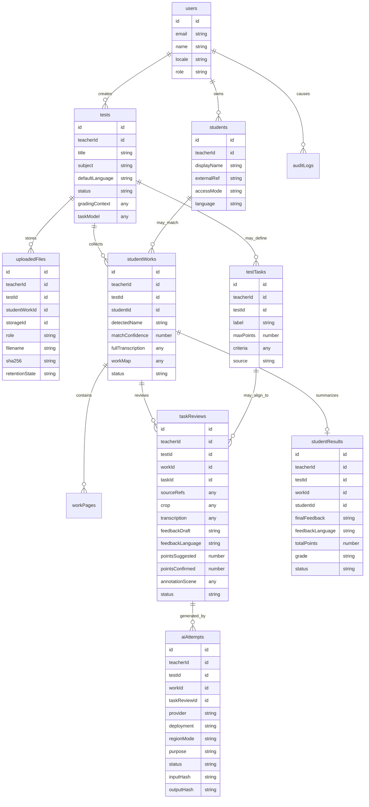
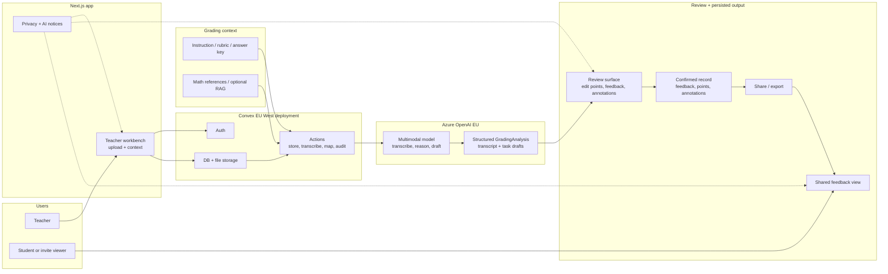
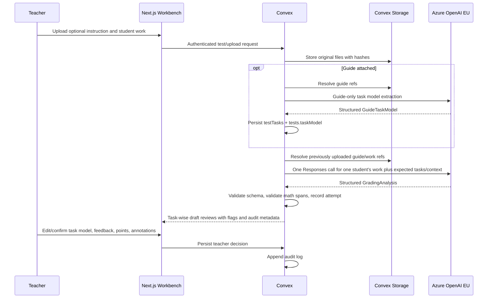

# RedPen System Model And Architecture

Status: draft
Date: 2026-05-20

## Purpose

RedPen is an AI-assisted mathematics homework and test grading platform for teachers working with students aged 13+. The system helps a teacher transcribe handwritten work, understand task structure, draft feedback, suggest point allocation, and create editable red-pen annotations. It does not autonomously grade, publish, or send results. The teacher remains responsible for every task decision, annotation, point value, grade, and shared student result.

The architecture should borrow useful implementation ideas from PunanePastakas, especially the teacher-controlled review workspace and Excalidraw-style annotation flow, but PunanePastakas is an example rather than the definitive processing pipeline. RedPen should keep the model simple, flexible, and robust enough for ambiguous handwritten documents, varied grading instructions, and multiple languages.

## Product Boundary

RedPen has two product roles:

- `teacher`: owns an account, creates tests, manages their own student entities, uploads instructions and student work, runs AI assistance, reviews/edit results, confirms feedback and points, and optionally exports or shares results.
- `student`: exists primarily as an entity attached to a teacher account. If student-facing access is enabled, the student authenticates or uses a teacher-issued invite to view only feedback that the teacher explicitly shared with that student.

There are no schools, school admins, MTU admins, or superadmins in the MVP data model. The hosted operator may still administer infrastructure, billing, incident response, and support outside the app model, but ordinary product data access is not represented as a platform role.

## Stack

- Frontend: Next.js App Router, React, TypeScript, Tailwind CSS, lucide-react, pdfjs-dist, KaTeX, and Excalidraw or an Excalidraw-compatible annotation surface.
- Backend: Convex database, functions, file storage, HTTP actions if useful, scheduled cleanup, and native Convex Auth.
- AI provider: OpenAI-compatible client configured for Azure OpenAI / Microsoft Foundry Models in production. Local development may use direct OpenAI only with synthetic data unless an eligible EU data residency project is configured.
- Knowledge context: curated mathematics pedagogy, Estonian curriculum, teacher-provided grading instructions, optional solved examples, and project-maintained documents. Runtime retrieval can use Convex/RAG if the MVP needs it, but the first implementation should stay straightforward.
- Hosting: frontend and any upload proxy must run in EU infrastructure, or uploads should go directly from the browser to Convex.

## Multilinguality

The product should support Estonian and English from the beginning:

- UI language: Estonian and English, with Estonian as the initial default for the Estonian pilot.
- Teacher inputs: grading instructions may be in Estonian or English.
- Student work: handwritten answers may include Estonian, English, mathematical notation, or a mixture.
- AI output: the teacher can choose feedback language per test, but that choice is app-owned request context rather than a model-produced output field.
- Internal schemas: store teacher-selected language metadata on tests and final feedback where useful. The MVP `GradingAnalysis` output does not include detected language, requested feedback language, language notes, or language confidence.

## Source Repository Findings

PunanePastakas is the closest implementation reference:

- `README.md` describes a teacher-controlled task-by-task prototype with Convex-backed persistence, structured model output, review state, and Excalidraw annotations.
- `AGENTS.md` identifies a working crop-based flow: upload, layout detection, browser-side task crops, crop analysis, review, re-analysis, annotation editing, and confirmation.
- `convex/schema.ts` has useful prototype tables such as `reviewRuns`, `uploadedFiles`, `taskReviews`, `taskCropFiles`, and `analysisAttempts`.
- `components/annotation-canvas.tsx` proves the red-pen annotation interaction pattern.
- `lib/analysis-schema.ts` is the central contract for model output, UI, persistence, and tests.

The crop-based flow is not a requirement. It is one implementation option. RedPen should prefer the simplest reliable multimodal pipeline first, then introduce cropping where it improves cost, annotation geometry, retry behavior, or teacher review.

Maasiku-unistus is useful as a product and policy precedent:

- `AGENTS.md` emphasizes Estonian UI, human oversight, AI transparency, deletion of raw work images after approval/share, and audit logging.
- `components/AITransparencyMarker.tsx` is a useful pattern for marking AI-generated content.
- `lib/audit.ts` and the result lifecycle concepts are useful conceptually, while the broader institution-management Prisma model should not be ported into this simplified Convex model.

## Authority And Access

Authorization principle:

- Every public Convex function starts with `ctx.auth.getUserIdentity()` or an equivalent Convex Auth helper.
- Teacher ownership is the primary authorization boundary. A test, student entity, upload, AI attempt, review, and result belongs to exactly one teacher account.
- Student access is optional and narrow. A student can view only results explicitly shared with the student entity linked to their invite/auth identity.
- The client never asserts ownership. Ownership is derived from authenticated user identity and Convex records.
- Service-to-service calls use internal functions where possible. Public HTTP endpoints use authenticated sessions or signed short-lived upload tokens.

The system should avoid hidden backdoor product roles. If operational support needs break-glass access later, it should be designed as a separate audited support workflow and added to the DPIA before production use.

## Core Domain Model

Key simplifications:

- `students` are teacher-owned records, not shared institution-wide identities.
- A `studentWork` can start with only a detected name and be matched to a teacher-owned `student` later.
- `testTasks` are helpful when the model or teacher can identify stable tasks, but task structure is allowed to be incomplete, ambiguous, or revised.
- `gradingContext` can include the teacher's instruction document, free-text rubric notes, answer key, examples, curriculum context, or nothing beyond the student work itself.

## Runtime Architecture

The runtime architecture: teacher action, app surface, Convex persistence and orchestration, AI/context assistance, teacher confirmation, then student/share output.

## Teacher Journey

1. Teacher signs in.
2. Teacher creates or opens a test.
3. Teacher optionally uploads a grading instruction (`hindamisjuhis`) as an image, PDF, or text. The instruction is useful context, not a hard prerequisite.
4. Teacher uploads student work images or PDFs.
5. If a grading instruction is uploaded, the system first extracts a stable test task model from that guide: task order, labels, point maxima, point criteria, evidence references, and uncertainty flags.
6. The system sends each uploaded student work through one whole-work analysis call. When a guide-derived task model exists, the student-work call must use that same expected task structure for every student in the test; otherwise it can infer visible tasks from the work and context.
7. The system uses the available context and task model to propose task-level feedback, point suggestions, review flags, and sparse annotation targets. The context may include the instruction document, teacher notes, answer key, curriculum references, previous confirmed examples, or simply the full student work.
8. Teacher reviews the AI draft. If task boundaries are useful, the teacher can review task by task. If the instruction and student work do not align cleanly, the teacher can review a more holistic result and split or merge tasks manually.
9. Teacher edits or confirms feedback, points, and annotations.
10. Teacher confirms each student's overall result and optional grade.
11. Teacher shares feedback with the student or exports it. Student-facing access is limited to teacher-shared feedback.

## AI Processing Pipeline

The first MVP should use the most straightforward robust multimodal pipeline: one analysis request per student's complete uploaded work. If a `hindamisjuhis` / grading guide is attached, RedPen first runs a guide-only task model extraction call for the test, then each student-work analysis uses that persisted expected task structure. It does not need to crop first and it should not send a whole class of students in one model call.

Recommended pipeline stages:

- Intake: store the original instruction and student work files once, with hashes and metadata.
- Guide task extraction: when `grading_context` uploads exist, extract and persist a stable expected task model for the test before student work analysis. This task model is teacher-reviewable and shared by all student works in the test.
- Context assembly: combine all `grading_context` uploads for the test, the persisted expected task model when present, and all `student_work` uploads for one `studentWorks` record. The grading context is labeled as guide/rubric/answer-key context, never as student work.
- Whole-work analysis: ask the multimodal model to transcribe the complete work, identify the visible student name, fill every expected task when a guide-derived task model exists, draft grading feedback and point suggestions, and suggest minimal mark-only annotations.
- Structured validation: parse the response as `GradingAnalysis`, validate KaTeX math spans in task-wise transcript and feedback text, record the attempt, and leave malformed outputs retryable.
- Task-wise review: persist one task review row per proposed task so the teacher can confirm, edit, reject, split, or replace the draft.
- Optional crop refinement: only crop or re-send smaller regions when needed for annotation precision, unreadable handwriting, cost reduction, retrying a failed section, or teacher-requested re-analysis.
- Teacher confirmation: persist the teacher's final decision separately from the AI draft.

This pipeline accepts that a `hindamisjuhis` may mirror the student work structure, differ from it, cover only part of it, or be absent. When the guide produces an expected task model, missing expected tasks should stay visible in the review queue with not-visible/uncertain evidence status rather than being omitted or automatically graded as zero. The LLM should add concrete review flags when the instruction or upload is ambiguous and avoid pretending that missing rubric details are certain.

## Data Minimization Position

For the prototype and early EU-resident LLM calls, it is acceptable to send a whole uncropped test image or PDF page, including a visible student name, to the LLM when that is the simplest reliable way to transcribe and grade the work. This is still compatible with data minimization when:

- the processing is necessary for the teacher-requested grading workflow;
- production inference stays inside the documented EU data residency setup;
- provider-side training is disabled;
- files are retained only as long as needed for review, audit, and teacher-confirmed feedback;
- the teacher sees and confirms all output before sharing;
- access is scoped to the owning teacher and shared student;
- the DPIA documents why full-page processing is proportionate for the prototype.

This simplifies the system model: RedPen does not need a mandatory pre-LLM anonymization or crop-first layer before it can work. As the product matures, it can add selective pseudonymization, cropping, redaction, or task-local retries when they improve privacy, cost, or accuracy without making the teacher workflow brittle.

## Pipeline Flexibility Rules

- The system should treat model outputs as structured drafts, not facts.
- Task IDs should be stable once the teacher confirms them, but the model can propose task splits differently per work until teacher review.
- Full-page transcription is the base layer. Crops are derived artifacts, useful for UI and re-analysis but not required as the first processing step.
- Annotation targets should reference both semantic evidence ("line where sign changed") and approximate geometry when available.
- The model should explicitly mark uncertainty through review flags such as unclear handwriting, incomplete page, missing rubric, mismatched instruction, multiple plausible solution paths, uncertain points, or uncertain transcription.
- The model output should not include language metadata or confidence scores. Teacher-selected feedback language is request context owned by the app.
- Mathematical output shown to teachers or students must be KaTeX-safe: task-wise transcript and display text use `\(...\)` / `\[...\]`, and invalid math falls back safely.
- Prompt contracts should be versioned because changes to model behavior affect grading behavior.

## EU Data Residency Position

Production can be designed to keep customer content in the EU if the following deployment constraints are treated as mandatory:

1. Convex deployment region is selected as EU West (Ireland) when the project is created. Convex states that all infrastructure powering a deployment is hosted in the selected region, and the currently listed EU region is EU West (Ireland). Existing deployments cannot be changed between regions; migration requires export/import into a new deployment.
2. Azure OpenAI / Foundry Models production deployments use either `DataZoneStandard` or `DataZoneProvisionedManaged` in an EU region, where prompts and responses are processed within the EU data zone, or `Standard` / `ProvisionedManaged` in a single EU region where stricter single-region processing is needed.
3. Azure "Global" deployment types are prohibited for student data because Microsoft documents that prompts and completions for global deployments may be processed globally, including outside the EU.
4. Azure tenant/resource setup should be aligned with the Microsoft EU Data Boundary where available. Microsoft describes the EU Data Boundary as covering storage and processing of Customer Data and personal data for Azure services, subject to documented limited transfers.
5. Direct OpenAI API use is allowed only for synthetic/local development unless the organization has an eligible OpenAI API project with Europe data residency, required regional endpoint configuration, and required ZDR/abuse monitoring controls. Production should default to Azure.
6. Frontend/serverless hosting must not become the hidden processor of raw student images outside the EU. Prefer direct authenticated browser upload to Convex; if Next.js API routes receive files, pin the runtime to an EU region and document hosting as a sub-processor.

## Open Source License

Project license: **GNU Affero General Public License v3.0 only (AGPL-3.0-only)**.

Reason: RedPen is a web application intended to be hosted as a service for teachers. AGPL closes the common SaaS loophole: if someone modifies and runs RedPen for users over a network, they must offer the corresponding source code for that modified version. This fits the project goal of keeping improvements to a public-interest education tool available to the community.

Implementation note: add a repository-root `LICENSE` file with the AGPL-3.0-only text and use the SPDX identifier `AGPL-3.0-only` in package metadata when package metadata exists.

## Public Repository Rules

- Never commit real student work, names, grades, API keys, teacher-managed student lists, production exports, or screenshots containing identifiable student data.
- Keep `test-files/` synthetic or explicitly licensed and anonymized.
- Store legal documents, architecture notes, PRDs, prompt contracts, schema descriptions, benchmark methodology, and synthetic fixtures in the public repository.
- Store private teacher data, runtime data, audit exports, and signed legal agreements outside the public repository.
- `.env.example` should name required variables without real values.

## Compliance Controls Built Into The Architecture

- Human oversight: AI cannot publish feedback or grades. Teacher confirmation is required before a result is shared.
- Transparency: every AI-generated draft shown to teachers or students is marked as AI-assisted and paired with teacher responsibility language.
- Data minimization: full-page LLM processing is acceptable for the prototype when it is necessary, EU-resident, logged, and retained briefly; crop-level or pseudonymized processing can be added later where it improves proportionality.
- Retention: raw uploads and derived crops have a short retention policy after teacher confirmation/share; teacher-confirmed feedback remains according to the teacher's configured retention policy and applicable law.
- Auditability: log AI attempts, teacher edits, confirmations, shares, exports, deletions, access checks, and failed authorization checks.
- No model training: disable provider-side training and do not use production student data for fine-tuning unless a separate, explicit, documented training consent and anonymization flow exists.
- Multilingual reliability: store the teacher-selected feedback language as app metadata and require teacher-visible review flags when the model is unsure about terminology, transcription, mathematical notation, or rubric fit.

## References

- Convex regions: https://docs.convex.dev/production/regions
- Convex authentication and authorization: https://docs.convex.dev/auth
- Convex Auth: https://labs.convex.dev/auth
- Azure OpenAI / Foundry deployment types: https://learn.microsoft.com/en-us/azure/foundry/foundry-models/concepts/deployment-types
- Azure data privacy for Models sold by Azure: https://learn.microsoft.com/en-us/azure/foundry/responsible-ai/openai/data-privacy
- Microsoft EU Data Boundary: https://learn.microsoft.com/en-us/privacy/eudb/eu-data-boundary-learn
- Microsoft optional transfers for global AI deployment types: https://learn.microsoft.com/en-us/privacy/eudb/eu-data-boundary-transfers-for-optional-capabilities
- OpenAI API data controls: https://platform.openai.com/docs/guides/your-data
- EU AI Act, Regulation (EU) 2024/1689: https://eur-lex.europa.eu/eli/reg/2024/1689/oj
- GDPR, Regulation (EU) 2016/679: https://eur-lex.europa.eu/eli/reg/2016/679/oj
- GNU AGPLv3: https://www.gnu.org/licenses/agpl-3.0.html
- SPDX license identifiers: https://spdx.org/licenses/
