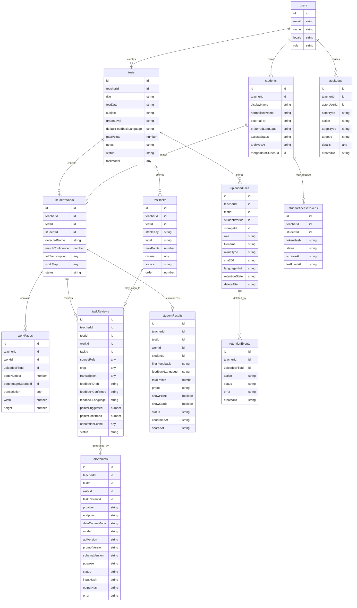

# feat: Implement AI-Assisted Grading MVP

## Overview

Implement RedPen as a desktop-first, teacher-controlled MVP for AI-assisted mathematics grading. The teacher creates tests, manages teacher-owned student entities, uploads optional grading context and student work, receives structured AI-assisted drafts, reviews and edits every output, confirms final feedback/points/annotations, and optionally shares the confirmed result with a linked student viewer.

The implementation should follow the RedPen system model and PRD rather than porting either reference product wholesale. PunanePastakas provides the closest technical reference for a Next.js + Convex + structured-output + annotation workbench. Maasiku-unistus provides useful precedent for AI transparency, approval/share lifecycle, audit logging, and retention, but its broader school/admin/Prisma model is intentionally out of scope.

## Research Summary

### Local Findings

- No matching brainstorm document exists in `docs/brainstorms/`.
- No institutional learnings exist in `docs/solutions/`; there is no `critical-patterns.md` to inherit.
- The RedPen repo is currently documentation-first. It has `README.md`, product/architecture docs, compliance outlines, and an empty `docs/plans/` directory.
- `README.md` already links to this expected plan filename, so creating `docs/plans/2026-05-20-001-feat-ai-assisted-grading-mvp-plan.md` also repairs that missing reference.
- The PRD defines eleven MVP requirement groups: auth/ownership, teacher-owned students, test context, uploads, AI analysis, teacher review, final result, student feedback view, compliance links, retention/deletion, and public collaboration rules.
- The architecture doc defines the stack as Next.js App Router, React, TypeScript, Tailwind, lucide-react, pdfjs-dist, KaTeX, Excalidraw-compatible annotation, Convex, and an OpenAI-compatible model provider. This plan now scopes the MVP to the regular OpenAI API first, with Azure OpenAI / Foundry Models moved to a later production-hardening phase.

### Reference Repository Findings

- PunanePastakas demonstrates the workbench pattern: upload, task detection, bounded crop analysis, Convex persistence, review, annotation editing, and final confirmation.
- PunanePastakas `lib/analysis-schema.ts` is the best local precedent for a single TypeScript/Zod contract that ties together model output, UI state, persistence, and tests.
- PunanePastakas `convex/schema.ts` and `convex/reviews.ts` show useful tables and attempt lifecycle, but RedPen must replace the access-token-only run authorization with authenticated teacher ownership.
- PunanePastakas `components/annotation-canvas.tsx` and `lib/annotation-harness.ts` show how to seed and validate Excalidraw-style red-pen marks from structured AI annotation output.
- Maasiku-unistus `components/AITransparencyMarker.tsx` confirms that every AI-generated user-visible content surface should be marked.
- Maasiku-unistus `lib/audit.ts` shows the useful principle that audit writes should not break the primary flow.
- Maasiku-unistus cleanup and review flows show the approval/share lifecycle, but RedPen should use Convex scheduled cleanup and the simplified two-role model from the system model.

### External Research Findings

- Convex regions are chosen when a deployment is created. Convex currently lists US East and EU West (Ireland), states all infrastructure for a deployment is hosted in the selected region, and says existing deployment regions cannot be changed.
- Convex public functions should use Convex Auth server helpers, derive the current user with `getAuthUserId(ctx)`, and enforce access control on every public query/mutation/action. Never accept user identity as a client assertion.
- Convex supports short-lived upload URLs and cron jobs in `convex/crons.ts`, which fits direct browser-to-Convex upload and scheduled retention cleanup.
- OpenAI API data controls state that API data is not used to train or improve OpenAI models unless the customer explicitly opts in. By default, abuse-monitoring logs may retain customer content for up to 30 days unless Zero Data Retention or Modified Abuse Monitoring controls are approved and enabled.
- OpenAI API data residency is configured per project for eligible customers. For Europe data residency, OpenAI documents the `eu.api.openai.com` regional endpoint and additional requirements, including approval for abuse-monitoring controls and a Zero Data Retention amendment for non-US regions.
- Azure OpenAI / Foundry remains the production target after the MVP because Microsoft Foundry deployment docs distinguish Global, Data Zone, and regional deployments. For production student content, allow only EU Data Zone (`DataZoneStandard` / `DataZoneProvisionedManaged`) or single-region EU deployment types; Global deployment types are prohibited because prompts/responses may be processed outside the EU.
- The European Commission AI Act page states the AI Act entered into force on 1 August 2024 and is generally applicable from 2 August 2026, with a May 7, 2026 political agreement setting a later timeline for high-risk systems used in areas including education. Treat this as a moving legal target and build high-risk controls now rather than waiting for deadline certainty.
- AKI guidance for DPIAs and legitimate interest reinforces that high-risk processing should document purposes, data categories, recipients, retention, assets, necessity/proportionality, security, data subject rights, processor relationships, transfers, and DPO/data-subject consultation where appropriate.

## Problem Statement

Teachers need faster drafting of useful mathematics feedback, but student assessment is sensitive: AI output can be wrong, student work contains personal data, and the product materially supports evaluation of learning outcomes. The MVP must therefore be useful as a grading workbench while preserving teacher authority, a documented OpenAI API data-control posture, strict ownership boundaries, AI transparency, auditability, and short retention for raw student work. Azure/Foundry EU processing remains the later production posture.

## Proposed Solution

Build a working RedPen MVP in phases:

1. Bootstrap a Next.js App Router + Convex project with TypeScript, Tailwind, native Convex Auth support, EU-region environment guardrails, and AGPL/public-repo hygiene.
2. Implement authenticated teacher ownership and teacher-owned student entities.
3. Implement test creation, optional grading context, upload intake, file hashing, page metadata, and advisory student-name matching.
4. Implement a full-document-first AI pipeline through the regular OpenAI API for the MVP, using a provider boundary that can later swap to Azure OpenAI / Foundry Models for production.
5. Implement the teacher review workbench with document viewing, transcription/work map, task model editing, draft review, point/feedback edits, uncertainty flags, and Excalidraw-compatible annotation editing.
6. Implement final result confirmation, optional mock export, and explicit teacher sharing to a narrow student feedback view.
7. Implement audit logs, retention jobs, app-linked compliance docs, AI transparency notices, production config checks, and benchmark/test gates.

## Product Scope

### In Scope

- Teacher accounts backed by Convex auth/user records.
- Teacher-owned student entities with display name, optional external reference, preferred language, archive/merge status, and optional student access state.
- Test creation for mathematics with optional grade/level, feedback language, max points, notes, and optional grading context.
- Upload of JPG/PNG/PDF student work and instruction/context files.
- Convex file storage in an EU deployment, with metadata, hashes, language hints, retention state, and deletion audit entries.
- Full-document transcription, work mapping, rubric/context interpretation, draft feedback, suggested points, annotation targets, uncertainty flags, and language metadata.
- Teacher review of every draft before any student-visible sharing.
- Optional crop refinement for annotation precision, unclear handwriting, cost control, partial retries, or teacher-requested re-analysis.
- Estonian and English UI/feedback paths from the start, with Estonian as the initial pilot default.
- Student feedback view for teacher-shared, teacher-confirmed results only.
- Compliance/documentation surfaces linked from the app.
- Public-repo guardrails: AGPL-3.0-only, `.env.example`, synthetic fixtures only, no real student data.

### Out Of Scope

- Autonomous grading or automatic publishing.
- School, school admin, MTU admin, or superadmin product roles.
- Production eKool/Stuudium integration; only a mock export is allowed.
- Fine-tuning or model training on student work.
- Mandatory crop-first or mandatory anonymization-before-LLM pipeline.
- Mobile-first workflow; mobile must be readable, but desktop review is primary.
- Subjects beyond mathematics.

## Key Product Decisions

- **Student access default:** Use teacher-issued invite links/tokens for MVP. This avoids adding an email provider before the student-view flow is proven. Magic links can replace or supplement this later after the email provider is approved in the sub-processor register.
- **Points visibility default:** Hide points/grade from students by default. The teacher can explicitly choose to show points and/or grade per shared result.
- **Retention default:** Use configurable retention with concrete MVP defaults: raw uploads and derived crops are retained during active review, then queued for deletion within 24 hours after sharing/archival, and never longer than `RAW_FILE_RETENTION_DAYS=14` unless a DPO-approved configuration overrides it. Unshared abandoned drafts are deleted after `ABANDONED_DRAFT_RETENTION_DAYS=30`.
- **Provider default:** MVP uses the regular OpenAI API through the official SDK/Responses API, with `store: false` where applicable, model/prompt/schema version logging, and documented OpenAI data controls. If any real student work is used in an MVP pilot, the project should prefer OpenAI Europe data residency and approved ZDR/MAM controls where available, or explicitly document the residual data-processing posture in the DPIA before processing. Azure OpenAI / Foundry EU deployment is a later production-hardening phase, not an MVP blocker.
- **Annotation depth:** Store approximate geometry and semantic evidence in MVP. Add crop refinement when annotation precision matters, but do not make crop-first analysis a prerequisite for grading.
- **Compliance stance:** Treat RedPen as high-risk-adjacent/high-risk for design controls unless counsel/DPO documents a different conclusion. Build audit, transparency, human oversight, risk management, and technical documentation hooks into the product now.

## Technical Approach

### Architecture

Use the runtime shape from `docs/architecture/system-model.md`, adjusted for the MVP provider decision: teacher action -> Next.js workbench -> Convex auth/storage/functions -> regular OpenAI API provider adapter -> structured draft -> teacher review -> confirmed result -> share/export/student view. The adapter boundary must preserve a clean path to Azure OpenAI / Foundry later.

The first implementation should be straightforward and contract-driven:

- Keep application data in Convex EU deployment. AI inference for the MVP uses the OpenAI API with documented data controls; production later moves to Azure OpenAI / Foundry EU deployment unless OpenAI Europe data residency/ZDR posture is formally approved for production.
- Use Next.js for UI, static compliance pages, and any thin server boundary that does not receive raw files unless explicitly region-pinned and documented.
- Prefer direct authenticated browser upload to Convex storage.
- Use Convex internal functions/actions for server-to-server AI orchestration.
- Treat model output as drafts. Persist teacher-confirmed state separately from AI attempts.
- Version AI prompts and structured output schemas.
- Log metadata and hashes, not raw prompts in admin-like views.

### Initial Module Map

- `app/`: App Router routes, layouts, server components, workbench pages, student share pages, compliance pages.
- `components/`: upload controls, document preview, workbench layout, review panes, task model editor, annotation canvas, AI transparency marker, language controls.
- `lib/`: shared TypeScript/Zod schemas, AI output contracts, prompt builders, provider adapter types, file validation, hashing helpers, language helpers, annotation geometry helpers, compliance copy constants.
- `convex/`: schema, auth config, public/internal functions, AI actions, storage helpers, share-token functions, audit functions, retention cron jobs, validators.
- `scripts/`: synthetic fixture checks, benchmark runners, compliance config checks, no-real-student-data scans.
- `docs/`: PRD, architecture, compliance docs, this plan, future benchmark methodology.

### Domain Model

### Convex Data And Authorization

- Create `convex/auth.ts`, `convex/http.ts`, and `convex/auth.config.ts` for native Convex Auth.
- Extend Convex Auth's `users` table with app-specific optional teacher profile fields; use Convex Auth user IDs as owner IDs.
- Every teacher-owned table includes `teacherId` and indexes scoped by teacher plus the dominant access pattern.
- Every public Convex function starts by deriving the current user identity server-side and resolving the current teacher record.
- No public function accepts `teacherId`, `userId`, or owner identity as an authorization source from the client.
- Student invite-token access resolves through a token hash and checks the linked `studentId` and `studentResults.status === "shared"` before returning anything.
- Use `internalQuery`, `internalMutation`, and `internalAction` for AI orchestration, retention cleanup, audit writes, and any workflow that should not be internet-callable.
- Use validators for every public and internal function.
- Avoid unbounded `.collect()` calls. Use indexes, pagination, bounded `.take()`, and self-scheduling batches for retention cleanup.

### AI Output Contracts

Create a RedPen-specific contract in `lib/ai-schemas.ts` rather than copying PunanePastakas names verbatim. Include:

- `language`: detected input language and requested output language.
- `transcription`: page-level and line/snippet-level text/math with confidence.
- `studentIdentityDraft`: detected visible name, evidence, confidence, and "teacher must confirm" flag.
- `workMap`: likely tasks, page refs, semantic evidence, approximate coordinates, uncertainty.
- `contextInterpretation`: what grading context was used, what was missing/ambiguous, and whether rubric points are clear.
- `taskDrafts`: mistake types, process analysis, suggested points, feedback draft, teacher review flags.
- `annotationTargets`: semantic evidence, approximate geometry when available, self-check flags, confidence, and rejection reason when not localizable.
- `overallDraft`: summary feedback and optional grade/points suggestion.
- `reviewFlags`: unclear handwriting, missing page, mismatched rubric, language uncertainty, multiple valid solution paths, safety/privacy warnings.

The schema must be shared by:

- prompt builders;
- provider adapter parsing;
- Convex validators or validator-compatible persistence fields;
- review UI state;
- test fixtures and benchmark checks.

### AI Provider Adapter

Implement a provider boundary so the MVP can ship on the regular OpenAI API without coupling the domain model to one vendor-specific runtime. Azure OpenAI / Foundry should be implemented later behind the same interface for production hardening.

- `lib/ai/provider.ts`: provider-neutral request/response types.
- `lib/ai/openai.ts`: MVP OpenAI API implementation using the official SDK and Responses API for multimodal structured output.
- `lib/ai/azure-openai.ts`: later production adapter, explicitly out of MVP unless the implementation reaches the production-hardening phase early.
- `convex/aiActions.ts`: Convex action layer that calls the configured provider and records attempts.

Required Next/local environment variables:

- `NEXT_PUBLIC_CONVEX_URL`
- `CONVEX_DEPLOYMENT_REGION`
- `RAW_FILE_RETENTION_DAYS`
- `DELETE_AFTER_SHARE_HOURS`
- `ABANDONED_DRAFT_RETENTION_DAYS`

Required Convex backend environment variables:

- `SITE_URL`, `JWT_PRIVATE_KEY`, and `JWKS` from native Convex Auth setup.
- `OPENAI_API_KEY`
- `OPENAI_MODEL`, defaulting to the preferred MVP model `gpt-5.5`.
- Optional `OPENAI_BASE_URL` when using a regional endpoint such as `https://eu.api.openai.com`.

MVP startup/deploy checks must fail when:

- `CONVEX_DEPLOYMENT_REGION` is not EU West/Ireland or a documented future EU region.
- `NEXT_PUBLIC_OPENAI_API_KEY` or any other public OpenAI secret is configured.
- real-student pilot mode is enabled without a documented OpenAI data-control decision in the DPIA.
- Azure provider variables are used before the Azure/Foundry production adapter exists and has been reviewed.
- frontend/upload proxy runtime is outside the EU while raw file proxying is enabled.
- required compliance links or `.env.example` entries are missing.

### Upload And File Processing

- Generate Convex upload URLs from authenticated mutations.
- Prefer direct browser upload to Convex storage so Next.js does not become a hidden raw-file processor.
- Validate accepted types: JPG, PNG, PDF.
- Enforce size and count limits in both UI and Convex functions.
- Hash file bytes and store metadata.
- Re-encode JPG/PNG where feasible to strip EXIF before storage while preserving visual content for grading. For PDFs, document metadata limitations and avoid extracting or displaying metadata unnecessarily.
- Store original files with `retentionState`, `deleteAfter`, and audit events.
- For PDF preview/AI input, use `pdfjs-dist` to render page images for the review UI and page-level model input. Store derived page images/crops as derived artifacts with their own retention states.
- Never include real student files in public fixtures, screenshots, GitHub issues, benchmark commits, or docs.

### Teacher Workbench UX

The first screen should be the usable workbench, not a marketing page.

Core views:

- Test list/create flow.
- Student entity manager with create/edit/archive/merge.
- Test setup panel with grading context and default feedback language.
- Upload intake with file validation, progress, and detected-name queue.
- Name matching review where suggestions are advisory and teacher-correctable.
- AI processing status per work/page/task with retry and failure states.
- Review workspace with original page viewer, transcription, work map, context interpretation, task drafts, points, feedback, review flags, and annotation canvas.
- Final result screen with total points, optional grade, final feedback, visibility toggles, confirmation, mock export, and share action.
- Student feedback view showing only shared teacher-confirmed content and AI transparency language.

Design principles:

- Use a dense, operational teacher workbench inspired by PunanePastakas, not a landing-page composition.
- Keep AI uncertainty and teacher actions visually close to the draft they affect.
- Use lucide-react icons for tool buttons and provide `aria-label` / `title` for icon-only controls.
- Use stable dimensions for document viewers, toolbars, annotation canvases, and status indicators.
- Ensure desktop/laptop layouts do not overlap controls and mobile remains readable.
- Mark AI-generated content before confirmation and in student view where applicable.

### Review And Confirmation Lifecycle

Recommended states:

- `studentWorks.status`: `uploaded`, `transcribing`, `mapped`, `drafted`, `needs_review`, `reviewed`, `confirmed`, `shared`, `archived`, `error`.
- `taskReviews.status`: `needs_review`, `accepted`, `edited`, `rejected`, `manual`, `confirmed`.
- `studentResults.status`: `draft`, `confirmed`, `shared`, `archived`.
- `uploadedFiles.retentionState`: `active`, `queued_for_deletion`, `deleted`, `delete_failed`, `retained_by_policy`.

Rules:

- AI drafts never become student-visible until a teacher confirms the result.
- Teacher edits are persisted separately from AI drafts.
- Teacher can accept, edit, reject, or manually replace each AI-assisted draft.
- Points and grade are optional and teacher-controlled.
- Sharing requires a confirmed result and an explicit action.
- Student view never exposes raw AI prompts, hidden teacher notes, unconfirmed drafts, unrelated teacher records, or other students' work.

### Audit And Retention

Audit at minimum:

- auth success/failure and failed authorization checks;
- student/test/work creation and edits;
- file upload, hash, storage ref, deletion;
- AI attempt started/completed/failed, provider, endpoint/base URL, region setting, data-control mode, model, API version if applicable, prompt/schema version, input/output hashes;
- name match decisions;
- task model edits;
- teacher edits to feedback, points, annotations;
- result confirmation, sharing, export mock;
- student view access;
- retention job output and deletion failures;
- production config guard failures.

Retention jobs:

- Define `convex/crons.ts` for recurring cleanup.
- Use internal mutations/actions in bounded batches.
- Delete storage objects first, then patch metadata to `deleted` or delete rows according to the chosen audit model.
- Audit deletion attempts and failures.
- Provide teacher-owned audit export for their account/test.

### Compliance Surfaces

- Add footer and contextual links to privacy/AI transparency notice, DPA outline, sub-processor register, template notification pack, AI Act technical documentation, and DPIA draft.
- Render compliance docs from repository markdown or maintain route-level pages that are kept in sync with `docs/compliance/`.
- Add teacher-facing onboarding copy: AI output is draft only, teacher must review, upload only their own class/test work, do not use public bug reports with real student data.
- Add student-facing age-appropriate AI transparency copy in Estonian and English.
- Keep controller/processor language configurable because the docs explicitly leave direct-teacher versus school-controller analysis open.

## Implementation Phases

### Phase 0: Repository Foundation And Guardrails

Tasks:

- Create the app scaffold in the current repo using Next.js App Router, React, TypeScript, Tailwind, ESLint, Convex, zod, lucide-react, pdfjs-dist, KaTeX, and Excalidraw-compatible annotation dependencies.
- Add `LICENSE` with AGPL-3.0-only and package metadata SPDX identifier.
- Add `.env.example` with all required provider, Convex, region, retention, and local-development variables.
- Add no-real-student-data documentation and a lightweight scan script for common fixture/screenshot/data leak paths.
- Add initial `README.md` setup instructions for local synthetic development and production region requirements.
- Add basic CI or local scripts: `typecheck`, `lint`, `build`, `test`, `test:fixtures`, `test:ai-contracts`, `test:retention`, `test:config`.

Success criteria:

- A fresh checkout can install dependencies, start the Next.js/Convex development loop, and see the teacher workbench shell.
- Production-like config checks fail closed for missing/unsafe region/provider settings.
- Public repository hygiene requirements are documented and testable.

### Phase 1: Auth, Users, Ownership, And Student Entities

Tasks:

- Configure native Convex Auth.
- Implement `users` resolution by `getAuthUserId(ctx)`.
- Implement helper functions for `requireTeacher`, `requireOwnedTest`, `requireOwnedStudent`, `requireOwnedWork`, and `requireSharedStudentResult`.
- Implement teacher-owned `students` CRUD with archive and merge flows.
- Implement student invite-token model with token hashing, expiration, revocation, and audit logging.
- Add negative authorization tests for cross-teacher access and invalid student tokens.

Success criteria:

- Teachers can only access records they own.
- Students/invite viewers can only access explicitly shared results linked to their student entity.
- No school/admin/MTU/superadmin product roles are introduced.

### Phase 2: Tests, Context, Uploads, And Work Intake

Tasks:

- Implement test (`kontrolltöö`) creation/editing with title, date, optional grade/level, feedback language, optional max points, notes, status.
- Implement grading context upload as image/PDF/text: `hindamisjuhis`, rubric, answer key, solved examples, or free-text instructions.
- Implement JPG/PNG/PDF student work upload with metadata, hashes, retention fields, and file role.
- Implement PDF page rendering for preview and model input.
- Implement student work records that can begin unmatched with detected-name candidates.
- Implement advisory name matching UI and teacher confirmation/correction.
- Add synthetic fixtures only.

Success criteria:

- Teacher can create a test, upload optional context, upload multiple student works, and see each work queued for analysis.
- The flow works when no grading context is provided.
- Name matching is advisory and teacher-correctable before sharing.
- Real student files are blocked from public fixtures by policy and scan.

### Phase 3: OpenAI API Contracts, Provider Adapter, And Full-Document Analysis

Tasks:

- Define RedPen Zod schemas for transcription, work map, context interpretation, task drafts, annotation targets, review flags, and overall draft.
- Define prompt builders with version constants and explicit human-oversight/uncertainty requirements.
- Implement the MVP OpenAI API provider adapter using the official SDK and Responses API.
- Send image/PDF-derived page inputs and text context through the OpenAI API with structured output parsing and `store: false` where supported.
- Implement Convex AI actions for full-document transcription, work mapping, grading draft, and optional crop refinement.
- Record `aiAttempts` with provider, base URL/region setting, model, API version if applicable, data-control mode, prompt/schema version, purpose, status, input/output hashes, timestamps, and error.
- Ensure model calls set non-storage parameters where supported and do not use student data for training/fine-tuning.
- Add mocked provider tests and schema parse tests for good output, malformed output, missing rubric, no instruction document, Estonian/English output, and uncertainty flags.

Success criteria:

- A synthetic student work can produce full-document transcription, work map, task drafts, suggested points, annotation targets, and review flags.
- Failed or malformed model output is recorded as a failed attempt and surfaced to the teacher with retry options.
- MVP config uses the regular OpenAI API and logs the selected data-control posture.

### Phase 3b: Production Provider Hardening With Azure OpenAI / Foundry

Tasks:

- Implement Azure OpenAI in the backend provider path used by Convex AI actions; a shared provider-interface extraction remains optional follow-up work.
- Add Azure/Foundry environment variables: `AZURE_OPENAI_ENDPOINT`, `AZURE_OPENAI_API_KEY`, `AZURE_OPENAI_DEPLOYMENT`, `AZURE_OPENAI_API_VERSION`, `AZURE_OPENAI_REGION`, `AZURE_OPENAI_DEPLOYMENT_TYPE`, and `AZURE_OPENAI_CONTENT_LOGGING_DISABLED`.
- Enforce EU Data Zone or single EU region deployment modes for student content.
- Block Azure `Global` deployment types in production.
- Update the sub-processor register, DPIA, and production deployment runbook before switching real production traffic.

Implementation note (2026-05-28): the RedPen Convex AI action now supports `REDPEN_AI_PROVIDER=azure_openai` with fail-closed deployment, endpoint, EU region, deployment-type, and content-logging checks. Real production traffic still requires live Azure account evidence and compliance record updates.

Success criteria:

- Provider can be switched from `openai` to `azure_openai` without changing review/domain code.
- Production config blocks global/non-EU Azure deployments.
- Compliance docs describe the final production provider and region posture.

### Phase 4: Teacher Review Workbench And Annotation

Tasks:

- Implement document viewer with page navigation, task/work references, and optional crop focus.
- Implement review panel for transcription, work map, context interpretation, evidence, uncertainty, feedback draft, suggested points, and annotation draft.
- Implement task model editor: edit, split, merge, reorder, ignore.
- Implement accept/edit/reject/manual-replace decisions per task draft.
- Implement final feedback editing in Estonian or English.
- Adapt Excalidraw-compatible annotation canvas from PunanePastakas, with RedPen-specific schema and scene persistence.
- Add crop refinement/re-analysis for unclear handwriting, annotation precision, partial retry, and teacher-requested re-analysis.
- Record teacher decisions, edit timestamps, review time, and audit logs.

Success criteria:

- Teacher can review a work holistically or task by task.
- Teacher can edit every AI-generated field before confirmation.
- AI-generated content and uncertainty are visibly marked.
- Annotation targets can be accepted, edited, removed, or replaced manually.

### Phase 5: Final Results, Sharing, Student View, And Mock Export

Tasks:

- Implement confirmed result records with final feedback, optional points, optional grade, visibility toggles, confirmation timestamp, and teacher identity.
- Implement explicit share action to linked student entity.
- Implement invite-token student route that shows only shared confirmed feedback/annotations and selected points/grade.
- Hide teacher notes, raw prompts, unconfirmed drafts, and unrelated records.
- Implement optional mock eKool/Stuudium export after confirmation, clearly marked as mock/non-production.
- Add student view authorization and denial tests.

Success criteria:

- 100% of student-visible feedback has a teacher confirmation record.
- Student can open their shared result and cannot access another result.
- Points/grade are hidden unless teacher opted in.
- Mock export is unavailable before confirmation.

### Phase 6: Retention, Compliance Pages, And Audit Export

Tasks:

- Implement `convex/crons.ts` cleanup jobs with configurable retention.
- Queue deletion after sharing/archival and for abandoned drafts.
- Delete raw uploads/page images/crops while preserving confirmed feedback and audit metadata according to policy.
- Implement teacher-owned audit export for tests/results.
- Add compliance routes/links for privacy notice, AI transparency, DPA outline, sub-processor register, template notification pack, AI Act technical documentation, and DPIA draft.
- Update compliance docs to align `DPIA-draft.md` with the MVP OpenAI API architecture now, and clearly mark Azure/Foundry as the later production architecture.

Success criteria:

- Retention job deletes raw/crop files after the configured deadline and writes audit entries.
- App links to required compliance documents from footer and relevant feedback views.
- Audit export contains AI attempts, teacher decisions, shares, exports, and deletion events without raw student content.

### Phase 7: Benchmarking, QA, And Production Readiness

Tasks:

- Build a synthetic/anonymized benchmark set for handwritten mathematics.
- Measure task boundary acceptance, transcription quality, name detection precision/uncertain-match rate, point suggestion error, feedback edit rate, annotation localization acceptance, false confidence rate, and review time.
- Add integration scenarios from the PRD.
- Add browser checks for desktop/laptop workbench layout and mobile readability.
- Add security/privacy checks for cross-teacher access, invite-token scope, provider config, upload limits, and retention.
- Run DPO/legal review gates before any real student data pilot.

Success criteria:

- PRD acceptance scenarios pass with synthetic fixtures.
- MVP OpenAI API calls use `store: false` where supported and record data-control mode/endpoint metadata; later production Azure calls must not use global/non-EU deployment configuration.
- 0 raw student work files remain after configured retention deadline.
- Compliance docs and sub-processor register are review-ready.

## System-Wide Impact

### Interaction Graph

Teacher uploads work -> authenticated Convex mutation generates upload URL -> browser uploads file -> Convex mutation records metadata/hash/retention -> internal action starts transcription attempt -> provider adapter calls the OpenAI API -> structured output is parsed -> Convex records AI attempt and draft -> review UI renders draft with transparency and uncertainty -> teacher edits/confirms -> Convex persists teacher decision and audit log -> share action creates student-visible result -> retention cron queues/deletes raw artifacts.

Student opens shared link -> token hash resolves student entity -> Convex query checks linked student and shared result -> result is returned without hidden notes/prompts/drafts -> student view logs access -> expired/revoked token denies access.

Retention cron runs -> internal query finds due files by `deleteAfter` and state -> storage object deletion attempted -> metadata/audit patched -> failures remain retryable with error details.

### Error And Failure Propagation

- Upload validation errors return teacher-readable messages before storage.
- Storage failures leave no `uploadedFiles` row or create a failed intake audit event only.
- AI provider failures create failed `aiAttempts`, preserve existing draft/review state, and show retry options.
- Schema parse failures are treated as AI attempt failures, not partial truth.
- Retention deletion failures set `retentionState=delete_failed`, record error, and retry later.
- Audit write failure should be logged but should not block the primary teacher action; however, critical audit failure rates must be observable.
- Production config guard failures should fail startup/deploy, not degrade silently.

### State Lifecycle Risks

- Partial upload can orphan storage objects if metadata insert fails. Mitigation: finalize upload through a mutation that claims storage IDs and schedules cleanup for unclaimed files.
- AI attempt can finish after teacher edits. Mitigation: attempts include purpose/version and update only the intended draft slot; teacher-confirmed fields are never overwritten.
- Task split/merge can invalidate old task IDs. Mitigation: preserve stable keys after teacher confirmation and keep old source refs for audit.
- Student merge can break shared links. Mitigation: merged student records point to canonical student and shared result checks resolve canonical ownership.
- Retention can delete files still needed for active review. Mitigation: compute `deleteAfter` from work/result status and allow only internal retention functions to transition to deletion states.

### API Surface Parity

The same authorization and state transitions must apply through:

- teacher UI calls;
- Convex public functions;
- internal AI actions;
- invite-token student view;
- retention cron;
- mock export;
- audit export.

Do not add a Next.js route, Convex HTTP action, or script that bypasses teacher ownership or student share checks.

### Integration Test Scenarios

- Teacher creates a test, uploads `hindamisjuhis`, uploads three student works, receives full-document transcriptions/drafts, reviews one result, confirms it, shares it, and student opens it.
- Teacher processes student work without a grading instruction document.
- Teacher corrects uncertain student-name match before sharing.
- Teacher splits/merges model-proposed tasks during review and confirmed task IDs remain stable.
- Teacher requests crop refinement for unclear handwriting and the new attempt does not overwrite confirmed edits.
- Teacher switches feedback language between Estonian and English.
- Student attempts to open another student's result and is denied.
- Retention job deletes raw/crop files after configured policy and preserves confirmed feedback/audit metadata.
- MVP config check fails when Convex region is not EU, OpenAI API credentials/model are missing, `store: false` is not enforced for grading requests, or the configured OpenAI regional endpoint/data-control posture is inconsistent.

## SpecFlow Analysis

### User Flow Overview

1. **Teacher onboarding:** Teacher signs in, user record is created/resolved, and the workbench opens with owned tests only.
2. **Student setup:** Teacher creates or edits student entities, archives old entries, or merges duplicates.
3. **Test setup:** Teacher creates a mathematics test, selects feedback language, and optionally adds grading context.
4. **Upload intake:** Teacher uploads work files, sees validation/progress, and confirms or corrects detected student names.
5. **AI processing:** System transcribes, maps work, interprets context, drafts feedback/points/annotations, and marks uncertainty.
6. **Review:** Teacher reviews original pages, drafts, evidence, points, annotations, and task boundaries; teacher edits or rejects drafts.
7. **Confirmation:** Teacher confirms final feedback/points/annotations and optional grade.
8. **Share/export:** Teacher explicitly shares the result with the linked student or uses mock export.
9. **Student view:** Student opens only shared confirmed content and sees AI transparency plus teacher confirmation timestamp.
10. **Retention:** System deletes raw/derived artifacts according to policy and logs deletion.

### Critical Gaps Resolved By This Plan

- Student access method: teacher-issued invite token for MVP.
- Points visibility: hidden by default; teacher opt-in per result.
- Retention period: configurable with 14-day raw-file cap and 24-hour deletion target after share/archival.
- Annotation geometry: approximate by default; crop refinement on demand.
- Provider mode: regular OpenAI API for MVP; Azure OpenAI / Foundry EU deployment later for production hardening.
- DPIA framing: update existing direct-OpenAI wording into the current MVP architecture and add a separate production migration note for Azure/Foundry.

### Remaining Questions For DPO/Product Review

- Should the hosted service support individual-teacher controller scenarios at launch, or only school/controller agreements?
- Should the first real pilot require school-selected lawful basis before a teacher account can process real student work?
- What is the final audit retention period for AI Act/GDPR accountability logs?
- Which exact OpenAI API model should be used for the first Estonian handwriting/math benchmark, and what Azure deployment will later replace it for production?
- Should parent/student notice be mandatory before generating invite links, or handled outside the product by the school?

## Acceptance Criteria

### Functional Requirements

- [x] Teacher accounts exist in Convex-backed auth/user tables.
- [x] Every test, upload, student entity, work, AI attempt, review, result, and audit entry belongs to exactly one teacher account.
- [x] Teachers can access only records they own.
- [x] Student/invite viewers can access only teacher-shared confirmed results linked to their student entity.
- [x] Teacher can create, edit, archive, and merge student entities.
- [x] Teacher can create a mathematics test with optional grading context.
- [x] Teacher can upload JPG/PNG/PDF student work and optional image/PDF/text context.
- [x] System stores file metadata, hashes, language hints, and retention state.
- [x] System detects visible student names and treats matches as advisory.
- [x] System processes work even when no grading instruction document is available.
- [x] System performs full-document transcription before optional crop refinement.
- [x] AI output includes detected language, transcription, work map, evidence, likely mistake types, context interpretation, suggested points, draft feedback, annotation targets, and review flags.
- [x] AI output supports Estonian and English feedback according to teacher-selected language.
- [x] AI attempts are logged with provider, endpoint/base URL, region setting, data-control mode, model, API version if applicable, prompt/schema version, purpose, hashes, timestamps, status, and error.
- [x] Teacher can review, edit, accept, reject, split, merge, override, and confirm AI-assisted drafts.
- [x] Teacher-visible UI marks AI-generated content and uncertainty.
- [x] Teacher can confirm final feedback, optional points, optional grade, and annotations.
- [x] Teacher can share confirmed results with linked student entities.
- [x] Student view excludes other students' work, hidden teacher notes, raw prompts, and unconfirmed drafts.
- [ ] Privacy, AI transparency, DPA, sub-processor, template notification, AI Act technical documentation, and DPIA links are available in-app.
- [ ] Retention jobs delete raw uploads/derived crops according to policy and record audit entries.
- [x] Repository includes AGPL-3.0-only license, `.env.example`, and synthetic/anonymized fixtures only.

### Non-Functional Requirements

- [x] Strict TypeScript contracts for AI outputs, Convex validators, and UI state.
- [x] Production Convex deployment is EU West/Ireland or another documented EU region.
- [x] MVP AI calls use the regular OpenAI API through the provider adapter.
- [x] MVP OpenAI requests set `store: false` where supported and log endpoint/data-control metadata.
- [ ] Later production Azure/Foundry AI calls use EU Data Zone or single EU region deployment mode.
- [ ] Later production global AI deployment types are blocked for student data.
- [x] Provider-side training/fine-tuning on customer content is disabled.
- [ ] Upload and AI-triggering endpoints are rate-limited or otherwise abuse-resistant.
- [ ] UI is keyboard navigable, icon buttons have labels, and contrast is sufficient.
- [ ] Desktop review workspace has no overlapping controls at common laptop sizes.
- [ ] Logs and dashboards minimize raw student content exposure.
- [x] Public repo scans prevent real student data and secrets from being committed.

### Quality Gates

- [x] `pnpm typecheck`
- [x] `pnpm lint`
- [x] `pnpm build`
- [ ] Unit tests for schemas, validators, auth helpers, provider adapter, retention policy, and annotation geometry.
- [ ] Integration tests for PRD acceptance scenarios.
- [x] Browser tests/screenshots for teacher workbench and student view.
- [ ] Synthetic benchmark report generated before any real pilot.
- [ ] DPO/legal review completed before processing real student personal data.

## Success Metrics

- Teacher median review time per student result is measured.
- At least 70% of AI draft feedback is accepted with no or minor teacher edits in the first teacher-reviewed benchmark set.
- At least 80% of generated task/work maps are usable without major restructuring in the first benchmark fixture set.
- 100% of shared student feedback has a teacher confirmation record.
- 100% of AI drafts include input/output language metadata and uncertainty flags where relevant.
- 100% of MVP OpenAI API calls record endpoint/data-control mode and set `store: false` where supported.
- 0 later production Azure/Foundry AI calls use global/non-EU deployment configuration.
- 0 raw student work files remain after the configured retention deadline.

## Dependencies And Prerequisites

- Convex project created in EU West/Ireland before any production-like data exists.
- OpenAI API project/key, model choice, endpoint, and data-control posture documented for MVP.
- Azure OpenAI / Foundry resource and deployment approved in EU Data Zone or single EU region before production migration.
- DPA/sub-processor register entries for Convex, OpenAI, hosting provider, and any email/error-monitoring provider; add Microsoft Azure OpenAI / Foundry Models before the later production migration.
- Decision on hosted-service controller/processor model before real school pilot.
- Synthetic/anonymized fixture set for initial benchmark and tests.
- Legal/DPO review of DPIA, lawful basis text, retention policy, AI Act classification, and parent/student notices.

## Risk Analysis And Mitigation

- **Incorrect feedback or points:** Mandatory teacher confirmation, uncertainty flags, benchmark tracking, edit-rate metrics, no autonomous publishing.
- **Automation bias:** UI frames AI as draft, requires active teacher decisions, shows evidence and uncertainty next to suggestions.
- **Student privacy breach:** Teacher ownership checks, invite-token scope, signed/authenticated file access, no raw student data in public repo.
- **AI provider residency/data-control misconfiguration:** Startup/deploy config guard, AI attempt endpoint/data-control logging, OpenAI regional endpoint validation where configured, and later Azure Global deployment block.
- **Excessive retention:** Configurable retention, scheduled deletion, deletion audit logs, raw-file cap.
- **Prompt/schema drift:** Version prompts and schemas, store version in attempts, run benchmarks before changes.
- **Model hallucination or rubric mismatch:** Context interpretation must state ambiguity/missing rubric; suggested points are conditional on clear rubric.
- **Unsupported PDF/page handling:** Store original, render pages consistently, surface conversion failures and retry/manual review paths.
- **Cross-teacher leakage:** No client-provided ownership, exhaustive negative auth tests.
- **Legal timeline uncertainty:** Build high-risk controls now and keep compliance docs living; counsel/DPO decides final launch posture.

## Documentation Plan

- Update `README.md` after implementation with setup, environment, region guardrails, scripts, and synthetic-data rules.
- Keep `docs/architecture/system-model.md` updated with final schema, runtime flow, provider configuration, and retention behavior.
- Keep `docs/prd/mvp-prd.md` requirement status synchronized as features land.
- Update `docs/compliance/DPIA-draft.md` to align with the regular OpenAI API MVP architecture, including data controls, abuse monitoring retention, optional Europe data residency, and the later Azure/Foundry production migration.
- Complete `docs/compliance/subprocessor-register-outline.md` before production.
- Complete user-facing privacy/AI transparency copy in Estonian and English before pilot.
- Add benchmark methodology/results under `docs/benchmarks/` once fixtures exist.

## AI-Era Implementation Notes

- AI pair programming can accelerate scaffolding, but human review is required for auth, retention, provider configuration, and compliance-sensitive code.
- Any AI-generated code touching authorization, student data, model calls, or deletion requires explicit tests and review.
- Prompts and schemas are product behavior, not implementation trivia; version them and review changes like code.
- Do not paste real student work into AI tools, chat sessions, public issues, screenshots, or fixtures.

## Sources And References

### Internal Source Documents

- `docs/prd/mvp-prd.md:8` - MVP overview and teacher-controlled sharing model.
- `docs/prd/mvp-prd.md:40` - authentication, ownership, and access requirements.
- `docs/prd/mvp-prd.md:72` - AI analysis requirements.
- `docs/prd/mvp-prd.md:82` - teacher review requirements.
- `docs/prd/mvp-prd.md:99` - student feedback view requirements.
- `docs/prd/mvp-prd.md:111` - retention and deletion requirements.
- `docs/prd/mvp-prd.md:145` - MVP acceptance scenarios.
- `docs/prd/mvp-prd.md:158` - open product/legal questions.
- `docs/architecture/system-model.md:21` - intended stack.
- `docs/architecture/system-model.md:39` - reference repository findings.
- `docs/architecture/system-model.md:57` - authority and access rules.
- `docs/architecture/system-model.md:69` - core domain model.
- `docs/architecture/system-model.md:271` - full-document-first AI pipeline.
- `docs/architecture/system-model.md:308` - data minimization position.
- `docs/architecture/system-model.md:331` - EU data residency position.
- `docs/architecture/system-model.md:358` - compliance controls.
- `docs/compliance/privacy-and-ai-transparency-notice-outline.md:53` - AI transparency notice content.
- `docs/compliance/ai-act-technical-documentation-outline.md:21` - high-risk working assumption.
- `docs/compliance/ai-act-technical-documentation-outline.md:101` - audit trail specification.
- `docs/compliance/supporting-document-outlines.md:9` - DPIA currently flags provider-architecture alignment work; update it for the OpenAI API MVP and later Azure/Convex production migration.
- `docs/compliance/subprocessor-register-outline.md:8` - required sub-processors and residency requirements.
- `docs/compliance/DPIA-draft.md:220` - necessity/proportionality questions.

### Local Reference Files

- `/Users/andrius/Projects/PunanePastakas/README.md` - end-to-end prototype flow and commands.
- `/Users/andrius/Projects/PunanePastakas/AGENTS.md` - Convex, contract, review, visual, and validation conventions.
- `/Users/andrius/Projects/PunanePastakas/convex/schema.ts` - prototype Convex tables for runs, files, task reviews, crops, and attempts.
- `/Users/andrius/Projects/PunanePastakas/lib/analysis-schema.ts` - structured AI output contract precedent.
- `/Users/andrius/Projects/PunanePastakas/components/annotation-canvas.tsx` - Excalidraw annotation workbench precedent.
- `/Users/andrius/Projects/PunanePastakas/lib/annotation-harness.ts` - annotation confidence/self-check/geometry precedent.
- `/Users/andrius/Projects/PunanePastakas/convex/_generated/ai/guidelines.md` - current Convex AI coding guidelines.
- `/Users/andrius/Projects/maasiku-unistus/AGENTS.md` - transparency, consent, deletion, and spec-driven precedent.
- `/Users/andrius/Projects/maasiku-unistus/components/AITransparencyMarker.tsx` - AI transparency marker precedent.
- `/Users/andrius/Projects/maasiku-unistus/lib/audit.ts` - non-blocking audit write precedent.
- `/Users/andrius/Projects/maasiku-unistus/app/api/cron/cleanup/route.ts` - cleanup/retention precedent to translate into Convex cron.
- `/Users/andrius/Projects/maasiku-unistus/app/dashboard/tests/[id]/results/[resultId]/ResultReviewClient.tsx` - approve/share lifecycle precedent.

### External References

- Convex regions: https://docs.convex.dev/production/regions
- Convex auth: https://docs.convex.dev/auth
- Convex file upload URLs: https://docs.convex.dev/file-storage/upload-files
- Convex cron jobs: https://docs.convex.dev/scheduling/cron-jobs
- Convex best practices: https://docs.convex.dev/understanding/best-practices
- Next.js App Router / env docs: https://nextjs.org/docs
- Microsoft Foundry deployment types: https://learn.microsoft.com/en-us/azure/foundry/foundry-models/concepts/deployment-types
- Microsoft Foundry/Azure OpenAI data privacy: https://learn.microsoft.com/en-us/azure/foundry/responsible-ai/openai/data-privacy
- Microsoft EU Data Boundary: https://learn.microsoft.com/en-us/privacy/eudb/eu-data-boundary-learn
- OpenAI API data controls: https://platform.openai.com/docs/guides/your-data
- EU AI Act, Regulation (EU) 2024/1689: https://eur-lex.europa.eu/eli/reg/2024/1689/oj
- European Commission AI Act timeline: https://digital-strategy.ec.europa.eu/en/policies/regulatory-framework-ai
- EDPB DPIA resources: https://www.edpb.europa.eu/our-work-tools/our-documents/topic/data-protection-impact-assessment-dpia_en
- AKI DPIA checklist: https://www.aki.ee/lisa-1-andmekaitsealase-mojuhinnangu-tegemise-kontrollnimekiri
- AKI legitimate interest guidance: https://www.aki.ee/isikuandmed/juhendid/oigustatud-huvi
- GNU AGPLv3: https://www.gnu.org/licenses/agpl-3.0.html
- SPDX AGPL-3.0-only: https://spdx.org/licenses/AGPL-3.0-only.html
