# feat: Implement Empty State And Live Grading Flow

## Overview

Replace the current synthetic-first workbench with a real post-login empty state and a functional end-to-end grading flow for phases 0-5 of the existing MVP plan, excluding Phase 3b. After login, a teacher should see no placeholder students, tests, works, review drafts, or demo student links. Instead, the app should guide the teacher to create a test, optionally upload grading context such as `fixtures/synthetic/juhis.pdf`, upload student work such as `fixtures/synthetic/1o.jpg` and `fixtures/synthetic/1v.jpg`, run analysis, review drafts, confirm feedback, and share a real confirmed result.

The current repo has the right domain shape, but the runnable app is still a synthetic showcase. This plan turns the existing contracts into a live flow: Convex-backed queries/mutations for the UI, actual upload records, actual stored files as model inputs, real AI attempt lifecycle, and live student result access.

## Research Summary

### Local Findings

- No relevant brainstorm document exists in `docs/brainstorms/`.
- No institutional learnings exist in `docs/solutions/`; there is no `critical-patterns.md` to inherit.
- `README.md` says the UI uses synthetic data until Convex/Auth/OpenAI are configured. That is now the core gap to close.
- `components/workbench-shell.tsx` imports `syntheticAnalysis`, `syntheticAnnotationTargets`, `syntheticStudents`, and `syntheticTaskReviews` directly and renders placeholder test/student/work data.
- `components/document-viewer.tsx` renders a hard-coded synthetic page with `Ada Tamm` and `Algebra kontrolltoo`, not the uploaded file.
- `app/student/[token]/page.tsx` uses `syntheticSharedResult` instead of Convex-backed shared results.
- `convex/schema.ts` already contains the necessary MVP tables for users, students, tests, uploaded files, student works, work pages, task reviews, student results, AI attempts, audit logs, and retention events.
- `convex/tests.ts`, `convex/uploads.ts`, `convex/works.ts`, `convex/reviews.ts`, `convex/results.ts`, and `convex/students.ts` already provide much of the public mutation/query surface, but the UI does not use them yet.
- `convex/aiActions.ts` records an AI attempt but returns `syntheticAnalysisForConvex(...)` instead of reading uploads and calling the OpenAI provider.
- `lib/ai/openai.ts` contains a Responses API adapter with `store: false` and JSON schema output, but it only handles page image data URLs/text and is not wired into the Convex action.
- `fixtures/synthetic/README.md` states fixtures must be synthetic only. The available fixtures are `juhis.pdf` plus two JPEG work files, `1o.jpg` and `1v.jpg`.
- `todos/001-complete-p1-ai-assisted-grading-mvp-phases-0-5.md` marks the first MVP pass complete as a contract-first shell, and explicitly notes the real Convex/Auth/OpenAI setup remained manual.

### External Findings

- OpenAI Responses API supports multimodal content items including `input_image` with `image_url` and `input_file` with `file_url` or `file_id`.
- OpenAI Responses API structured outputs use `text.format` with `type: "json_schema"`, `name`, `strict`, and a JSON schema.
- OpenAI file uploads can use `purpose: "user_data"` and optional `expires_after`; files without an expiration may persist until manually deleted, so any file-upload fallback must explicitly expire or delete provider files.
- Convex file storage supports authenticated upload URLs through `ctx.storage.generateUploadUrl()`, and server code can retrieve stored file URLs with `ctx.storage.getUrl(storageId)` or blobs with `ctx.storage.get(storageId)`.
- Convex recommends scheduling actions from mutations for side-effectful external API work, so the app should use a mutation to authorize and enqueue AI analysis rather than letting the client directly orchestrate multi-step state changes.

## Problem Statement

The MVP currently demonstrates the intended UI with hard-coded synthetic state. That is useful for visual validation, but it breaks the product promise: after login, a teacher should start with their own empty workspace and create/upload/analyze real records. It also masks the most important integration risk, because the AI action succeeds without using the uploaded work, grading context, OpenAI adapter, or stored file inputs.

This creates three product and engineering problems:

- Teachers see fake students and fake work after login, so the empty onboarding path is not represented.
- The core flow cannot be validated with the new fixture files because uploads do not drive analysis or review state.
- The OpenAI processing path can pass tests while still being unable to analyze a PDF grading guide and JPEG work files in production-like use.

## Proposed Solution

Implement a live, empty-first workbench that uses Convex records as the source of truth. Keep synthetic data only for tests, stories, or an explicit development fixture helper, never as the default authenticated app state.

The teacher journey should become:

1. Sign in or create an account.
2. Land on an empty state when no tests exist.
3. Create a mathematics test.
4. Optionally upload grading context, including PDF context such as `fixtures/synthetic/juhis.pdf`.
5. Upload one or more student work files, including JPG files such as `fixtures/synthetic/1o.jpg` and `fixtures/synthetic/1v.jpg`.
6. Run analysis for each uploaded work.
7. Review actual AI drafts generated from the uploaded files and context.
8. Confirm feedback, points, and annotations.
9. Share the confirmed result through a live student route.

Phase 3b Azure/OpenAI production provider hardening remains excluded. This plan keeps the existing direct OpenAI MVP path and improves it enough to truly process uploaded files.

## Product Requirements

### Empty State

- Authenticated teachers with no tests see an empty workbench with a primary action to create a new test.
- No placeholder students, tests, works, annotations, review drafts, totals, mock exports, or student preview links appear in the default logged-in app.
- The empty state may show a compact three-step onboarding path: create test, add grading context, upload works.
- Upload actions are disabled or redirected until a test exists, with clear state-specific UI.
- If Convex is not configured, the app shows a setup-required state instead of a populated synthetic workbench.

### Test And Context Intake

- Teacher can create a test with title, optional date, grade/level, feedback language, max points, and notes.
- A newly created test opens to a test-level empty state.
- Teacher can upload optional grading context files with role `grading_context`.
- PDF grading context is accepted and passed to the analysis prompt as a grading guide, not treated as student work.
- The flow must work without grading context; the model should mark rubric/points uncertainty.

### Student Work Intake

- Teacher can upload multiple student work files with role `student_work`.
- Each uploaded work creates or attaches to a `studentWorks` record and an `uploadedFiles` record.
- A work can remain unmatched before analysis. Detected names are advisory only.
- No default student roster is created. Teachers can create students manually or confirm/create a student from the detected name after analysis.
- Upload progress, validation errors, and stored file metadata are visible enough for the teacher to know what happened.

### Analysis

- Running analysis uses the uploaded `student_work` files and all available `grading_context` files for the selected test.
- `convex/aiActions.ts` must stop returning synthetic analysis unless an explicit test/mock provider mode is selected.
- OpenAI input assembly must support:
  - JPG/PNG student work as `input_image` using a transient Convex storage URL or data URL.
  - PDF context or work as `input_file` using a transient Convex storage URL.
  - Text context as `input_text`.
  - Fallback upload to OpenAI Files with `purpose: "user_data"` only when URL-based input cannot work; fallback files must expire or be deleted and be recorded on the attempt.
- OpenAI calls must keep `store: false` and strict JSON schema output.
- Failed or malformed output must mark the work as `error`, record the failed `aiAttempts` row, and offer retry.

### Review, Confirmation, And Sharing

- The review workbench renders actual uploaded file previews, not the synthetic document.
- The review queue is empty until real `taskReviews` exist.
- Teacher can edit task review fields, feedback, points, and annotation scenes from Convex-backed state.
- Confirmation creates or updates a real `studentResults` row.
- Share action operates on a real confirmed result and returns a usable student link.
- Student route reads live Convex data and denies access to unrelated, unconfirmed, unshared, expired, or token-mismatched results.

## Technical Approach

### Architecture

Use the existing phase 0-5 architecture and preserve the current domain model. The main change is replacing synthetic UI state with live Convex data flow and replacing the synthetic AI action body with real request assembly and provider execution.

```mermaid
flowchart LR
  Login["Teacher signs in"] --> Empty["Empty test workspace"]
  Empty --> CreateTest["Create test"]
  CreateTest --> Context["Upload optional grading context"]
  CreateTest --> UploadWorks["Upload student works"]
  Context --> Run["Run analysis"]
  UploadWorks --> Run
  Run --> ConvexAction["Convex scheduled AI action"]
  ConvexAction --> Storage["Convex storage URLs/blobs"]
  Storage --> OpenAI["OpenAI Responses API"]
  OpenAI --> Drafts["Parsed RedPenAnalysis"]
  Drafts --> Reviews["taskReviews + work status"]
  Reviews --> Confirm["Teacher confirms result"]
  Confirm --> Share["Share student link"]
```



### UI State Model

The workbench should branch from live data:

- `auth_loading`: show session loading.
- `unauthenticated`: show login/sign-up.
- `setup_required`: Convex/Auth not configured; no synthetic data.
- `no_tests`: show create-test empty state.
- `test_empty`: test exists, no works yet; show context and work upload actions.
- `work_uploaded`: files exist, analysis has not run or is queued.
- `analysis_running`: work status `transcribing`, `mapped`, or `drafted` as applicable.
- `needs_review`: render task reviews and document preview.
- `confirmed`: result exists but is not shared.
- `shared`: result has a student-visible link.
- `error`: show attempt error and retry/manual options.

### Convex Flow

- Keep `tests.create`, `tests.list`, `uploads.generateUploadUrl`, `uploads.recordUploadedFile`, `works.create`, `works.listByTest`, `reviews.listByWork`, `reviews.updateDecision`, `results.confirm`, and `results.share` as the main public API surface.
- Add or adjust queries that return joined workbench data for one selected test:
  - selected test;
  - test-level grading context uploads;
  - student works;
  - work-level uploads;
  - latest AI attempts;
  - task reviews;
  - confirmed/shared result if present.
- Add a mutation such as `works.requestAnalysis` that:
  - authenticates the teacher;
  - verifies the work/test ownership;
  - verifies at least one student work upload exists;
  - patches status to `transcribing`;
  - schedules an internal action with `ctx.scheduler.runAfter(0, internal.aiActions.analyzeWorkInternal, { workId })`.
- Keep external API side effects inside the internal action.
- Make `works.applyAnalysisDraft` retry-safe by replacing stale draft reviews for the work or upserting by `stableKey` instead of inserting duplicates.

### OpenAI Request Assembly

Add a Convex-safe request assembly layer for analysis:

- Fetch the work, test, work uploads, and test grading context uploads.
- Generate transient Convex storage URLs with `ctx.storage.getUrl(storageId)` for each file.
- Build ordered content:
  - system/developer prompt;
  - teacher/test metadata;
  - teacher notes;
  - grading context files and text;
  - student work files with clear labels;
  - explicit instruction that context is advisory and teacher review is mandatory.
- For image uploads, prefer `input_image` with `image_url`.
- For PDF uploads, prefer `input_file` with `file_url`.
- For text uploads, include file text as `input_text` after fetching the blob.
- If Convex URLs are not accepted by the model request, fallback to OpenAI Files:
  - upload with `purpose: "user_data"`;
  - set `expires_after` where supported;
  - reference with `input_file.file_id`;
  - delete after the response when possible;
  - record provider file IDs on `aiAttempts`.

The existing `AnalyzeDocumentRequest` should be extended beyond `pages` to support context files and provider input refs:

```ts
type AIInputRef = {
  role: "grading_context" | "student_work"
  uploadId: string
  storageId: string
  filename: string
  mimeType: string
  sha256: string
  transport: "convex_url" | "openai_file" | "data_url" | "text"
  providerFileId?: string
}
```

Do not persist transient Convex URLs. Persist hashes, upload IDs, storage IDs, transport mode, provider metadata, and provider file IDs only when needed for cleanup/audit.

### Schema Adjustments

No new core domain table is required for the empty state. Add small AI attempt metadata only if implementation needs to track provider file fallback cleanup:

- `aiAttempts.inputRefs`: optional array of upload/storage refs, roles, transports, and hashes.
- `aiAttempts.providerFileIds`: optional array for temporary OpenAI File IDs.
- `aiAttempts.cleanupStatus`: optional string such as `not_needed`, `pending`, `completed`, `failed`.

If these fields are added, update validators, generated Convex types, and tests. Do not add Phase 3b Azure provider schema fields in this plan.

### Synthetic Fixtures

Synthetic fixtures should support testing without becoming app state:

- Keep `fixtures/synthetic/juhis.pdf`, `fixtures/synthetic/1o.jpg`, and `fixtures/synthetic/1v.jpg` under fixture policy.
- Use fixtures in automated tests, manual smoke tests, and optional explicit dev seeding only.
- Remove imports from `lib/synthetic-demo.ts` from the default workbench and student result route.
- Keep or move `lib/synthetic-demo.ts` behind tests/dev helpers if useful for mocked provider responses.
- Never auto-create placeholder students or works on signup.

## Implementation Phases

### Phase 0: Guardrails And Synthetic Boundary

Tasks:

- Inventory all runtime imports of `synthetic-demo` and `syntheticAnalysisForConvex`.
- Split synthetic/demo helpers from production UI code.
- Replace default synthetic mode with a setup-required state when Convex is not configured.
- Update README language so it no longer claims the main UI uses synthetic data as the normal state after login.
- Confirm fixture scan still passes for `fixtures/synthetic/juhis.pdf`, `1o.jpg`, and `1v.jpg`.

Success criteria:

- The default app route does not render fake tests/students/works.
- Synthetic data is only reachable through tests, explicit dev helpers, or an intentionally named dev route if one is kept.
- Missing Convex config does not produce misleading demo data.

### Phase 1: Authenticated Empty Workbench

Tasks:

- Refactor `app/page.tsx` and `components/workbench-shell.tsx` into an auth-aware live workbench.
- Use Convex queries for the teacher's tests and selected test state.
- Add `CreateTest` UI wired to `tests.create`.
- Show `no_tests` empty state after login when `tests.list` returns no records.
- Preserve existing auth panel behavior, but ensure sign-up/sign-in leads to the live empty state.
- Add loading, empty, and error states for Convex query failures.

Success criteria:

- A new authenticated teacher sees no placeholder records.
- Creating a test immediately replaces the empty state with the test workspace.
- Refreshing the page preserves the live Convex test state.

### Phase 2: Context And Work Upload Intake

Tasks:

- Add test-level grading context upload UI wired to `uploads.generateUploadUrl` and `uploads.recordUploadedFile`.
- Add work upload UI that creates a `studentWorks` row and records one or more `student_work` uploads.
- Validate files with `lib/file-validation.ts` before upload.
- Compute SHA-256 hashes client-side or server-side consistently before `recordUploadedFile`.
- Show upload progress, errors, and queued work status.
- List real context files and work files for the selected test.
- Support the path with no grading context.
- Support the path with `juhis.pdf` as grading context and `1o.jpg`/`1v.jpg` as two works.

Success criteria:

- Teacher can create a test, upload `juhis.pdf`, upload `1o.jpg` and `1v.jpg`, and see two queued works.
- Teacher can upload works without context and still proceed to analysis.
- No student entity is required at upload time.

### Phase 3: Real OpenAI Analysis Flow

Tasks:

- Replace the synthetic body of `convex/aiActions.analyzeWork` with an authenticated enqueue mutation plus internal action.
- Implement Convex-safe OpenAI request assembly from stored uploads.
- Extend provider input types to support `input_image`, `input_file`, text context, and provider input refs.
- Pass grading context files and teacher notes into the prompt.
- Preserve strict `RedPenAnalysisJsonSchema` parsing and `store: false`.
- Record started, completed, and failed attempts with input/output hashes, provider metadata, and transport details.
- Patch work status through `transcribing`/`needs_review`/`error`.
- Make retries idempotent and avoid duplicate `taskReviews`.
- Add explicit configuration behavior:
  - no OpenAI key and no explicit mock provider means visible configuration error, not synthetic success;
  - explicit mock provider is allowed in tests.

Success criteria:

- A synthetic fixture work can produce a live `RedPenAnalysis` through the OpenAI provider when configured.
- A mocked provider test can exercise the same Convex state transitions without external API calls.
- Malformed model output records a failed attempt and leaves the teacher with retry/manual options.
- Missing rubric/context produces uncertainty flags instead of blocking analysis.

### Phase 4: Live Review Workbench And Actual Document Preview

Tasks:

- Render real `taskReviews` from Convex instead of synthetic task drafts.
- Render uploaded image previews from owned Convex storage URLs.
- Render PDF previews with `pdfjs-dist` where needed.
- Keep annotation editing tied to stored `annotationScene`.
- Wire accept/edit/reject/manual/confirmed actions to `reviews.updateDecision`.
- Add name-match confirmation/create-student flow using detected name and `students.create` or `works.confirmNameMatch`.
- Hide final-result controls until a selected work has reviewable drafts or manual feedback.
- Keep AI transparency markers on generated drafts and uncertainty flags.

Success criteria:

- Teacher can inspect the actual uploaded work image/PDF and the AI draft generated for it.
- Teacher can review one work independently of another work in the same test.
- Teacher can edit every student-visible field before confirmation.
- Review UI is empty and calm when no work is selected or no analysis exists.

### Phase 5: Live Confirmation, Sharing, Student View, And Mock Export

Tasks:

- Wire final confirmation to `results.confirm` using the selected work, linked student, final feedback, points, grade, visibility toggles, and annotation scene.
- Ensure confirmation is blocked until a student is linked or the teacher explicitly creates/selects one.
- Capture the returned `resultId` in the UI.
- Wire `results.share` and return/display a real student link.
- Replace the synthetic student page with a live route. Prefer `/student/[token]/results/[resultId]`, because existing `results.getSharedByInviteToken` validates both token and result.
- Keep the current denial behavior for invalid, expired, unshared, or mismatched result access.
- Wire mock export to real confirmed/shared results, not local synthetic state.

Success criteria:

- Confirmed results are persisted in `studentResults`.
- Shared links show only the matching confirmed/shared result.
- Points and grade remain hidden unless teacher toggles visibility on.
- The mock export is unavailable before confirmation and reflects the live result after confirmation.

## SpecFlow Analysis

### User Flow Overview

1. First authenticated visit with no data:
   - Teacher signs in, sees empty state, creates a test.
2. Test setup with context:
   - Teacher opens a test, uploads `juhis.pdf`, sees it listed as grading context.
3. Test setup without context:
   - Teacher skips context, uploads works, analysis still runs with uncertainty.
4. Work upload:
   - Teacher uploads `1o.jpg` and `1v.jpg`, sees each as a queued work.
5. Analysis success:
   - Teacher starts analysis, work transitions to running, drafts appear, teacher reviews.
6. Analysis failure:
   - Provider/config/schema failure records attempt error and offers retry/manual path.
7. Name matching:
   - AI detects a name, teacher links existing student, creates a new student, or leaves unmatched until before sharing.
8. Confirmation:
   - Teacher finalizes feedback and points, then confirms.
9. Sharing:
   - Teacher shares result, student route validates token/result and shows only permitted fields.
10. Return visit:
   - Teacher reloads and sees persisted tests, works, review status, and result state.

### Flow Permutations Matrix

| Area | Happy path | Empty path | Error path |
| --- | --- | --- | --- |
| Auth | Signed-in teacher sees tests | Signed-in teacher has no tests | Convex/Auth unavailable |
| Context | PDF guide uploaded | No context uploaded | Unsupported file or upload failure |
| Works | Multiple JPG/PDF works uploaded | Test has no works | File too large, wrong type, metadata insert fails |
| Analysis | OpenAI returns valid schema | No rubric, lower confidence | Missing key, URL fetch failure, malformed JSON |
| Review | Teacher accepts/edits drafts | No selected work | Duplicate retry, stale review state |
| Sharing | Confirmed result shared | No linked student yet | Expired token, wrong result, unshared result |

### Gaps To Address During Implementation

- Upload finalization must avoid orphaned storage objects if metadata insert fails.
- `workPages` can remain optional for MVP, but document preview needs a reliable source for images/PDFs.
- Retrying analysis must not duplicate task reviews or leave old annotations mixed with new drafts.
- Student links need both a token and result identity, or the route must intentionally list all shared results for the token's student. This plan chooses token plus result ID.
- Provider fallback files must be deleted or expired if OpenAI Files are used.
- The UI needs explicit configuration errors when OpenAI is not configured.

## System-Wide Impact

### Interaction Graph

Teacher creates test -> `tests.create` writes `tests` -> workbench query updates.

Teacher uploads work -> `uploads.generateUploadUrl` returns URL -> browser POSTs file -> `works.create` and `uploads.recordUploadedFile` persist metadata -> work appears queued.

Teacher runs analysis -> `works.requestAnalysis` validates ownership and status -> schedules `aiActions.analyzeWorkInternal` -> action fetches uploads and context -> provider call runs -> `aiAttempts` and `studentWorks` are patched -> `taskReviews` are inserted/upserted -> workbench query renders drafts.

Teacher confirms -> `results.confirm` writes `studentResults` and patches work -> `results.share` marks shared -> student route reads via token/result validation.

### Error And Failure Propagation

- Upload validation errors stay client-visible and do not create records.
- Storage POST success plus metadata failure should create a cleanup/audit path or retry finalization.
- Provider configuration errors should become failed `aiAttempts` and work `error` state.
- OpenAI schema parse errors should preserve the raw failure summary, not raw student content.
- Review update failures should leave the textarea/input state recoverable and show a retry message.
- Share failures should not expose unconfirmed results.

### State Lifecycle Risks

- Partial uploads can orphan storage objects. Mitigate with finalize semantics and cleanup for unclaimed uploads.
- Analysis retry can duplicate task reviews. Mitigate by replacing stale drafts or upserting by work/stableKey.
- A result can be confirmed for the wrong student if name matching is not explicit. Mitigate by requiring linked student before confirmation/share.
- Provider file fallback can leave files in OpenAI storage. Mitigate with `expires_after`, delete calls, and attempt cleanup metadata.
- Student links can overexpose if token-only route lists too much. Mitigate with result-scoped route or strict list filtering.

### API Surface Parity

- Main workbench and student view must both use live Convex paths.
- Mock export must use the same confirmed `studentResults` source as share.
- Tests and dev fixtures may use a mock provider, but the production UI cannot silently switch to synthetic success.
- Any new route for student results must preserve `results.getSharedByInviteToken` authorization semantics.

### Integration Test Scenarios

- New authenticated teacher creates a test from empty state, reloads, and sees it persisted.
- Teacher uploads `juhis.pdf`, `1o.jpg`, and `1v.jpg`; two works appear queued.
- Mocked provider runs through the same analysis action path and creates `taskReviews`.
- OpenAI/mocked malformed output creates a failed `aiAttempts` row and visible retry state.
- Teacher confirms and shares a result; matching token/result opens, wrong token or wrong result is denied.
- Teacher processes a work without context and sees rubric uncertainty flags.

## Acceptance Criteria

### Functional Requirements

- [x] After login, a teacher with no tests sees an empty state and no placeholder data.
- [x] Teacher can create a new test from the empty state.
- [x] Teacher can upload grading context, including `fixtures/synthetic/juhis.pdf`.
- [x] Teacher can upload multiple work files, including `fixtures/synthetic/1o.jpg` and `fixtures/synthetic/1v.jpg`.
- [x] Teacher can run analysis on uploaded works.
- [x] Analysis uses uploaded files/context and does not return synthetic data unless an explicit test/mock provider is enabled.
- [x] Teacher can review actual Convex-backed drafts and actual uploaded document previews.
- [x] Teacher can confirm a result only after linking/creating the student entity required for sharing.
- [x] Teacher can share a real confirmed result and open a live student route.
- [x] Student route denies unrelated, unconfirmed, unshared, expired, or token-mismatched results.
- [x] The flow works when no grading context is uploaded.

### Non-Functional Requirements

- [x] No Phase 3b Azure/Foundry provider work is introduced.
- [x] OpenAI calls use `store: false` where supported.
- [x] OpenAI Files fallback is not used in this implementation; Convex URL/text transport avoids temporary provider files.
- [x] Public fixtures remain synthetic-only.
- [x] UI states are clear for empty, loading, queued, running, review, confirmed, shared, and error.
- [x] Client code does not import Node-only helpers.
- [x] Workbench remains desktop-first and does not show overlapping controls at common laptop widths.

### Quality Gates

- [x] `npm run typecheck`
- [x] `npm run lint`
- [x] `npm test`
- [x] `npm run test:ai-contracts`
- [x] `npm run test:fixtures`
- [x] `npm run build`
- [x] Browser smoke of the live route with no placeholder data (`screenshots/redpen-empty-live-flow.png`).
- [ ] Manual authenticated upload smoke with the three synthetic fixture files.
- [ ] Optional live OpenAI smoke only when a safe OpenAI key and approved synthetic-only config are present.

## Dependencies And Risks

- Convex deployment and Auth must be configured for true post-login behavior.
- OpenAI file/PDF/image behavior must be validated with the installed `openai` SDK version.
- Convex storage URLs must be accessible to OpenAI at request time. If not, the OpenAI Files fallback becomes required.
- Real student data must remain out of local/public testing.
- Browser e2e automation may require adding Playwright or an equivalent test harness if manual smoke is not enough.

## Alternative Approaches Considered

- Keep synthetic placeholders and add an empty-state banner. Rejected because the user explicitly wants no placeholder students/works and a functional flow.
- Auto-seed demo data on first login. Rejected because it hides the real onboarding path and creates fake teacher-owned records.
- Build a roster/student setup flow before uploads. Rejected for MVP because uploaded work can begin unmatched and name matching is advisory.
- Use OpenAI Files for every input. Not the default because Convex transient URLs avoid extra provider-side file persistence; keep as fallback.
- Implement Azure/Foundry Phase 3b now. Rejected because the requested scope explicitly excludes 3b.

## Documentation Plan

- Update `README.md` to describe the real empty-first flow and fixture-based smoke test.
- Update `fixtures/synthetic/README.md` only if additional notes are needed for `juhis.pdf`, `1o.jpg`, and `1v.jpg`.
- Update the existing MVP plan checkboxes only if implementation completes a previously marked gap.
- Add a short manual smoke checklist under README or docs if no browser test harness is added.

## Sources And References

### Internal References

- Existing MVP plan: `docs/plans/2026-05-20-001-feat-ai-assisted-grading-mvp-plan.md`
- PRD: `docs/prd/mvp-prd.md`
- Architecture: `docs/architecture/system-model.md`
- Current synthetic workbench: `components/workbench-shell.tsx`
- Current hard-coded document preview: `components/document-viewer.tsx`
- Current synthetic student route: `app/student/[token]/page.tsx`
- Convex schema: `convex/schema.ts`
- Upload functions: `convex/uploads.ts`
- Work functions: `convex/works.ts`
- AI action gap: `convex/aiActions.ts`
- OpenAI adapter: `lib/ai/openai.ts`
- AI contracts: `lib/ai-schemas.ts`
- Synthetic fixtures: `fixtures/synthetic/juhis.pdf`, `fixtures/synthetic/1o.jpg`, `fixtures/synthetic/1v.jpg`

### External References

- OpenAI PDF/file inputs: https://developers.openai.com/api/docs/guides/pdf-files
- OpenAI image inputs: https://developers.openai.com/api/docs/guides/images
- OpenAI structured outputs for Responses API: https://developers.openai.com/api/docs/guides/responses-vs-chat-completions
- OpenAI Files API: https://developers.openai.com/api/docs/api-reference/files/create
- Convex upload files: https://docs.convex.dev/file-storage/upload-files
- Convex serve files/storage URLs: https://docs.convex.dev/file-storage/serve-files
- Convex actions and scheduling: https://docs.convex.dev/functions/actions
