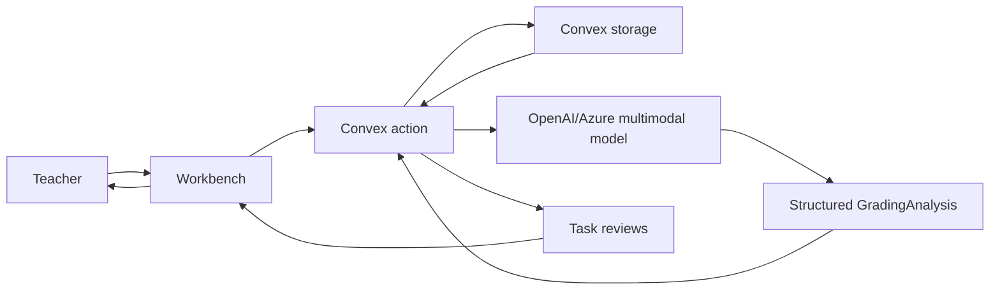
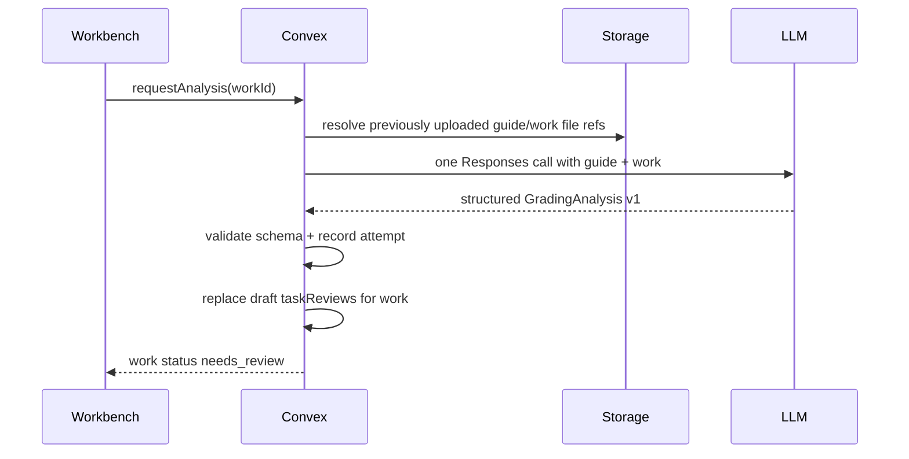

# feat: Simplify MVP AI Analysis Pipeline

## Overview

The MVP AI pipeline should be simpler than the architecture document currently implies. For the first usable application, analyze one student's complete uploaded work in one multimodal LLM inference call, with the optional `hindamisjuhis` / teacher guide attached as grading context. The model should return a structured `GradingAnalysis` draft containing the student's visible name, transcript, task-wise split, guidance-motivated grading, general feedback, suggested points, and minimal annotation targets. The app can run one such call per student work in parallel and then continue with the existing task-wise teacher confirmation flow.

This plan also removes language metadata from the LLM output contract. The AI output should not include a top-level `language` object, `detectedInputLanguage`, `requestedFeedbackLanguage`, language notes, language confidence, task-level `feedbackLanguage`, or `language_uncertainty`. If the product keeps a teacher-selected feedback language control, that value remains request/persistence metadata owned by the app, not something the model echoes back.

## Problem Statement

The current docs and schema still carry architectural weight from a more elaborate pipeline: language metadata, separate work mapping, context interpretation, task drafts, optional crop refinement, and annotation self-check fields. Some of this is useful later, but it creates unnecessary MVP complexity and has already made the strict OpenAI schema brittle.

The practical teacher workflow is simpler:

1. Teacher creates a test.
2. Teacher optionally uploads `hindamisjuhis`.
3. Teacher uploads each student's work.
4. RedPen sends one student's work plus the guide/context to the model.
5. RedPen receives a structured whole-work draft.
6. Teacher reviews tasks one by one, edits feedback/points/annotations, and confirms.

That should be the MVP baseline. Crops, retries by region, language audit metadata, and advanced task-model reconciliation can come later when there is real usage pressure.

## Research Summary

### Repository Research

- `docs/architecture/system-model.md` already says the crop-based flow is optional and that RedPen should prefer the simplest reliable multimodal pipeline first.
- `docs/architecture/system-model.md` still describes a two-step AI sequence and explicitly says the model returns "Name, language, page transcription, visible task/work map"; this should be revised.
- `docs/prd/mvp-prd.md` says there is no mandatory crop-first pipeline, but F5 still expects detected language in AI output and success metrics require input/output language metadata.
- `convex/aiActions.ts` already assembles all grading context uploads and all student work uploads for one `studentWorks` record into one OpenAI Responses request.
- `convex/works.ts` already turns `analysis.taskDrafts` into `taskReviews`, so teacher confirmation can remain task-wise after one whole-work call.
- `lib/ai-schemas.ts` currently still has `language: LanguageMetadataSchema` and per-task `feedbackLanguage`; recent strict-schema work made the object smaller but did not remove it.
- `lib/ai/prompts.ts` already tells the model to produce transcription, work map, context interpretation, task drafts, annotations, overall draft, and review flags. This can be made more direct and less duplicated.
- `components/workbench-shell.tsx` has dashboard controls and status flows for uploading context, uploading work, running analysis, reviewing task drafts, confirming results, and sharing.

### Institutional Learnings

No `docs/solutions/` directory or critical-patterns document was present, so there are no prior local learnings to carry forward.

### External Research

- OpenAI Responses API supports structured JSON output via `text.format` with `type: "json_schema"` and `strict`.
- OpenAI structured outputs require object schemas to opt into `additionalProperties: false`, and unsupported strict schemas fail at request time.
- OpenAI's current model docs describe latest models as supporting text and image input through the Responses API, which fits the full-work multimodal call shape.

Sources are listed at the end of this plan.

## Proposed Solution

Adopt a single-pass, per-student-work analysis pipeline:



Each model call receives:

- The test title and teacher notes.
- The teacher-selected output language only if the product keeps that control; this is request context, not output schema.
- All `grading_context` files for the test, clearly labeled as guide/rubric/answer key context.
- All `student_work` files for one `studentWorks` record, clearly labeled as the student's work.

The model returns one structured `GradingAnalysis` draft for that student work. The server parses it, persists the transcript and task review drafts, and records the AI attempt. Teachers then review task by task.

## Proposed Output Shape

Replace the current schema with a task-centric output shape. This removes the `language` wrapper entirely, removes model-produced confidence scores, removes context summary objects, and merges duplicated `workMap.tasks` plus `taskDrafts` into one `tasks` array.

```ts
type GradingAnalysis = {
  schemaVersion: "2026-05-21.grading-analysis.v1"
  studentName: {
    detectedName: string | null
    evidence: PageRef[]
  }
  transcription: {
    pages: {
      pageNumber: number
      pageLabel: string | null
      lines: {
        lineId: string
        rawText: string
        normalizedMathLatex: string | null
        pageRef: PageRef
      }[]
      missingOrUnclearRegions: PageRef[]
    }[]
  }
  tasks: {
    stableKey: string
    label: string
    likelyTaskNumber: string | null
    sourceRefs: PageRef[]
    transcriptExcerpt: string
    gradingRationale: string
    mistakeTypes: MistakeType[]
    suggestedPoints: {
      value: number | null
      max: number | null
      onlyIfRubricClear: boolean
    }
    feedbackDraft: string
    teacherReviewFlags: string[]
  }[]
  annotationTargets: {
    id: string
    taskStableKey: string | null
    shape: "circle" | "check" | "cross_out"
    pageRef: PageRef
    semanticEvidence: string
    rejectionReason: string | null
  }[]
  generalFeedback: string
  suggestedTotalPoints: number | null
  maxPoints: number | null
  suggestedGrade: string | null
  reviewFlags: ReviewFlag[]
}

type PageRef = {
  pageNumber: number
  lineId: string | null
  snippet: string | null
  box: { x: number; y: number; width: number; height: number } | null
}
```

Notes:

- All object properties must be present for OpenAI strict structured outputs. Use `null` instead of omitted fields.
- Teacher confirmation of the detected student name is always required by product policy, so the model does not need to return `teacherMustConfirm`.
- Remove `LanguageMetadataSchema`.
- Remove `TaskDraft.feedbackLanguage`; derive any persisted `taskReviews.feedbackLanguage` from the test setting if that DB field remains.
- Remove `ReviewFlagSchema` value `language_uncertainty`.
- Remove confidence fields entirely. For MVP, prefer concrete review flags such as `unclear_handwriting`, `missing_rubric`, `guide_mismatch`, or `points_uncertain` over fake precision.
- Do not include a `gradingContext` or `contextSummary` object in model output. Guidance use should show up in each task's `gradingRationale`, `suggestedPoints`, `feedbackDraft`, and review flags.
- Restrict model-generated annotations to `circle`, `check`, and `cross_out`. The annotation should mark the work; the feedback text should carry the explanation.
- Use `normalizedMathLatex` for KaTeX-compatible math only. It should contain raw LaTeX without `$...$`, `\(...\)`, Markdown, or prose; use `null` for non-math or uncertain lines.

## Math Rendering Contract

The system prompt must explain the math output rules because teachers will inspect transcript and feedback in a KaTeX-rendered UI.

Add guidance to `buildSystemPrompt()`:

```text
When returning mathematical notation:
- Put standalone normalized math only in normalizedMathLatex.
- normalizedMathLatex must be KaTeX-compatible LaTeX without delimiters, Markdown, or prose.
- Use simple KaTeX-supported notation such as \frac{}, ^{}, _{}, \sqrt{}, \cdot, \leq, \geq.
- If a transcript line is not mathematical, or if the math is too uncertain, return normalizedMathLatex as null.
- In display text fields such as transcriptExcerpt, gradingRationale, feedbackDraft, generalFeedback, and semanticEvidence, wrap inline math in \( ... \) and block math in \[ ... \].
- Do not use dollar-sign math delimiters.
```

Rendering rules:

- Create one shared AI text renderer, for example `components/math-text.tsx`, that escapes prose and renders only `\(...\)` / `\[...\]` math spans with KaTeX.
- Create one shared parser/validator, for example `lib/math-rendering.ts`, that validates `normalizedMathLatex` and every math span inside AI-generated display text with KaTeX.
- Use the shared renderer anywhere AI-generated text can appear: transcript lines, task transcript excerpts, grading rationales, feedback drafts, general feedback, annotation semantic evidence, teacher review flags, shared student feedback, exports, and review-history views.
- Invalid math should not crash the page. Render the original escaped text and surface a safe review flag or developer-visible validation error.
- Do not call KaTeX directly from scattered components; the shared renderer is the only display path for AI-generated math-bearing text.

## MVP Pipeline Behavior

### One Student Work



### Multiple Student Works

Add a batch request path that schedules one action per work:

1. Teacher selects "Run analysis" for all uploaded works or for selected works.
2. Mutation validates teacher ownership and that each work has at least one `student_work` upload.
3. Mutation marks each work as `transcribing` and schedules `internal.aiActions.analyzeWorkInternal` once per work.
4. Each action runs independently with the same grading context but only that student's work.
5. UI shows per-work progress, failure, retry, and review availability.

Use independent calls rather than one call containing all students. This avoids cross-student leakage in output, keeps retries small, and lets a single malformed output fail only one work.

## Implementation Phases

### Phase 1: Contract Simplification

- Update `lib/ai-schemas.ts`.
- Remove top-level `language`.
- Remove `LanguageMetadataSchema`.
- Remove `TaskDraft.feedbackLanguage`.
- Remove `ReviewFlagSchema` value `language_uncertainty`.
- Rename transcript line `normalizedMath` to `normalizedMathLatex`.
- Replace `workMap.tasks` plus `taskDrafts` with one top-level `tasks` array, or add a compatibility adapter if the UI needs a staged migration.
- Keep strict-schema regression coverage in `tests/ai-schemas.test.ts`.
- Update `lib/synthetic-demo.ts` and `convex/syntheticAnalysis.ts` to the `GradingAnalysis` v1 output shape.

Acceptance criteria:

- [x] `GradingAnalysisSchema` has no `language` property.
- [x] Generated JSON Schema has no object properties missing from `required`.
- [x] Synthetic fixtures parse against the `GradingAnalysis` v1 schema.
- [x] No model-produced language field remains in AI contract tests.
- [x] Transcript math is represented as `normalizedMathLatex`, not generic `normalizedMath`.

### Phase 2: Prompt And Provider Alignment

- Update `lib/ai/prompts.ts` to ask for one whole-work draft, not separate "work map" and "task drafts".
- Keep the guide prompt explicit: `hindamisjuhis` is grading context, never student work.
- Add KaTeX rules to `buildSystemPrompt()` for `normalizedMathLatex` and math spans in display text.
- Instruct the model to keep annotations sparse and mostly mark-only.
- Keep `store: false` in `convex/aiActions.ts` and `lib/ai/openai.ts`.
- Preserve the existing Convex URL/text input path for files.
- Keep fallback file-upload behavior out of this plan unless Convex URLs fail in live testing.

Acceptance criteria:

- [x] Prompt says one call should transcribe, identify tasks, draft feedback/points, and suggest minimal annotations.
- [x] Prompt no longer asks the model to return language metadata.
- [x] Prompt requires KaTeX-compatible LaTeX for `normalizedMathLatex` and `\(...\)` / `\[...\]` math spans in display text.
- [x] OpenAI request still uses `text.format.type = "json_schema"` with `strict: true`.
- [x] Malformed output creates a failed `aiAttempts` row and leaves the work retryable.

### Phase 3: Persistence Adapter

- Update `convex/works.ts` so `applyAnalysisDraft` creates `taskReviews` from `analysis.tasks`.
- If `taskReviews.feedbackLanguage` remains in the DB schema, set it from `test.defaultFeedbackLanguage`, not from model output.
- Store `work.fullTranscription` from `analysis.transcription`.
- Store a compact work summary from `analysis.generalFeedback`, point totals, `analysis.reviewFlags`, and `analysis.annotationTargets`.
- Delete/replace existing draft `taskReviews` on re-analysis as the current path does.

Acceptance criteria:

- [x] Re-analysis replaces old draft task reviews without mixing old annotations into new drafts.
- [x] Works with no guide still produce draft tasks and a missing-context warning.
- [x] Works with a guide that does not match the student work produce review flags instead of unsupported point claims.
- [x] Persisted review rows do not depend on LLM-produced language fields.

### Phase 4: KaTeX Rendering And Validation

- Add a shared math parsing/validation helper, for example `lib/math-rendering.ts`.
- Add a shared AI display text component, for example `components/math-text.tsx`.
- Validate `normalizedMathLatex` after parsing `GradingAnalysis`; invalid values should become `null` or produce a safe review flag.
- Parse and render math spans in every AI-generated display string through the shared renderer.
- Use the renderer for teacher review, transcript display, annotation evidence, shared student feedback, and export previews.
- Add tests for valid KaTeX, invalid KaTeX fallback, escaped prose, and mixed prose/math strings.

Acceptance criteria:

- [x] `normalizedMathLatex` is validated with KaTeX before display.
- [x] AI-generated `transcriptExcerpt`, `gradingRationale`, `feedbackDraft`, `generalFeedback`, and `semanticEvidence` render math spans through the shared renderer.
- [x] Invalid math never crashes the workbench or shared student view.
- [x] No component renders AI-generated math-bearing strings with ad hoc `dangerouslySetInnerHTML` or direct scattered KaTeX calls.

### Phase 5: Batch Scheduling

- Add a mutation such as `works.requestAnalysisBatch`.
- Accept either selected `workIds` or "all uploaded works for selected test".
- Validate ownership and upload presence for each work before scheduling.
- Schedule one `analyzeWorkInternal` action per work.
- Use per-work statuses instead of a single global batch status for MVP.
- Let the UI call the batch mutation from a "run all" control if/when the current workbench needs it.

Acceptance criteria:

- [x] Teacher can queue analysis for multiple uploaded works.
- [x] Each work has independent success/failure/retry state.
- [x] One failed work does not block other works from entering review.
- [x] AI attempts are recorded per work with input hashes and output hashes.

### Phase 6: Documentation Cleanup

- Update `docs/architecture/system-model.md`.
- Remove claims that AI output includes language metadata.
- Replace the two-step AI sequence with the one-call-per-student-work sequence.
- Keep optional crop refinement documented as future/rescue behavior only.
- Document the KaTeX math output and rendering contract.
- Update `docs/prd/mvp-prd.md` F5 and success metrics.
- Update README only if the documented MVP behavior changes.

Acceptance criteria:

- [x] Architecture, PRD, schema, prompt, and tests describe the same pipeline.
- [x] Docs say the MVP unit of AI processing is one student work, not one task crop and not one entire class.
- [x] Docs say language selection, if retained, is app-owned request context rather than LLM output metadata.

## SpecFlow Analysis

### User Flow Overview

1. With guide: teacher uploads `hindamisjuhis`, uploads student works, runs analysis for one or many works, reviews task drafts, confirms.
2. Without guide: teacher uploads only student work, runs analysis, sees point suggestions paired with missing-context flags.
3. Guide mismatch: teacher uploads a guide that covers different tasks; model should identify ambiguity and avoid unsupported point claims.
4. Batch partial failure: teacher queues five works; four succeed, one fails schema/API validation; successful works remain reviewable.
5. Re-analysis: teacher changes guide or notes and re-runs analysis; old draft task reviews are replaced.
6. Minimal annotation: model suggests sparse circles/checks/crosses; teacher can edit or remove them before confirmation.

### Flow Gaps To Address

- Batch rate limiting: MVP should tolerate provider 429s by marking affected works as failed/retryable; advanced queue backoff can come later.
- Large PDFs/images: plan should preserve one student-work call, but live testing must identify file-size limits and whether pre-rendering PDFs to pages is needed.
- Task identity stability: model-proposed `stableKey`s may change on re-analysis; teacher-confirmed reviews should not be silently overwritten after confirmation.
- Annotation geometry quality: if no reliable `box` is available, annotation target should be allowed but not auto-rendered until teacher places it.
- Product language setting: if the app keeps a feedback-language selector, it must be app metadata, not a model-generated field.
- Math rendering: AI output can include math anywhere teachers or students read it, so all AI-generated display strings must use the same KaTeX parsing path.

## System-Wide Impact

### Interaction Graph

`works.requestAnalysis` or `works.requestAnalysisBatch` validates ownership, patches work status, schedules `aiActions.analyzeWorkInternal`, which resolves previously uploaded guide/work file refs through `works.getForAi`, calls the provider, parses `GradingAnalysis`, records `aiAttempts`, and calls `works.applyAnalysisDraft`, which replaces draft `taskReviews`. The workbench then renders updated work status and review rows.

### Error And Failure Propagation

- OpenAI request failures should patch the attempt to `failed`, patch the work to `error`, and preserve a retry path.
- Schema failures should include a safe error summary, not raw student content.
- One failed batch item should not fail the entire batch from the teacher's perspective.

### State Lifecycle Risks

- Re-analysis currently deletes existing task reviews before inserting new ones. Preserve this only for draft/unconfirmed reviews; avoid deleting teacher-confirmed decisions without explicit re-analysis confirmation.
- If the batch mutation schedules some works and then fails, already scheduled works should remain valid and visible.
- If annotation targets lack boxes, the UI should not create broken annotation geometry.

### API Surface Parity

- Convex action path: `convex/aiActions.ts`.
- Local provider adapter path: `lib/ai/openai.ts`.
- Shared schema: `lib/ai-schemas.ts`.
- Prompt builder: `lib/ai/prompts.ts`.
- Math validation/rendering: `lib/math-rendering.ts` and `components/math-text.tsx`.
- Synthetic/mock provider fixtures: `lib/synthetic-demo.ts`, `convex/syntheticAnalysis.ts`.
- Task review persistence: `convex/works.ts`, `convex/reviews.ts`, `convex/results.ts`.

### Integration Test Scenarios

- [ ] Mock provider returns `GradingAnalysis` v1 output and creates task reviews.
- [x] Strict schema test fails if any object property is optional instead of required nullable.
- [ ] A no-guide work produces task drafts and review flags.
- [ ] Batch analysis schedules multiple works and handles one failure independently.
- [ ] Re-analysis of a draft work replaces draft reviews and annotations.
- [x] KaTeX validation accepts generated math such as `\frac{x+1}{2}` and safely falls back for invalid math.
- [ ] Teacher review and shared student views render the same AI text through the shared math renderer.

## Implementation Notes

### 2026-05-22 - Implemented In Branch

- Replaced the model contract with `GradingAnalysis` v1 and removed model-produced language metadata and confidence fields.
- Updated OpenAI prompt/provider paths, Convex AI action parsing, synthetic fixtures, and task review persistence.
- Added `works.requestAnalysisBatch` so the workbench can queue one independent analysis action per uploaded work.
- Added shared KaTeX validation/rendering helpers and routed task preview, feedback display, and annotation evidence through them.
- Updated architecture, PRD, README, and project agent instructions to describe the simplified pipeline.
- Verified with `npm run typecheck`, `npm run lint`, `npm run test:ai-contracts`, and focused Vitest coverage for annotation geometry and math rendering.

## Dependencies And Risks

- OpenAI strict structured outputs require the generated schema to stay within the supported subset.
- KaTeX syntax from the model may be invalid. Mitigate with explicit prompt rules, server/client validation, safe fallback rendering, and tests across every AI text display path.
- Large handwritten PDFs may exceed practical latency/cost even if the model context is large; add crop/page splitting later only if measurement demands it.
- Parallel calls may hit provider rate limits; MVP can expose retry state before building a full queue.
- Removing output language metadata conflicts with existing architecture/PRD language audit claims; docs must be updated so compliance expectations match implementation.
- If `defaultFeedbackLanguage` remains in the UI, developers must not mistake "remove language from LLM output" for "remove every app language control".

## Acceptance Criteria

- [x] RedPen analyzes one student's complete uploaded work plus optional guide in one LLM request.
- [x] Multiple student works can be analyzed in parallel as independent per-work requests.
- [x] The AI output schema has no `language` field and no LLM-produced feedback language fields.
- [x] The AI output schema uses one task-centric array for proposed exercises/tasks and task feedback.
- [x] Annotation targets are minimal and limited to circles, checks, and crosses for model output.
- [x] All model-produced math uses `normalizedMathLatex` or `\(...\)` / `\[...\]` spans and is validated/rendered through a shared KaTeX path.
- [x] Teacher confirmation remains task-wise after the whole-work draft is generated.
- [x] Missing, ambiguous, or mismatched guides produce uncertainty/review flags rather than blocking analysis.
- [x] Strict JSON schema contract tests prevent optional-property regressions.
- [x] Architecture and PRD docs match the simplified MVP pipeline.

## Success Metrics

- A teacher can upload three synthetic student works and run analysis for all of them without manually starting three separate flows.
- Each successful work enters `needs_review` with task rows the teacher can confirm.
- No OpenAI request fails because of optional JSON Schema properties.
- No AI-generated math display crashes because of invalid KaTeX.
- At least 80% of synthetic/live-safe test works produce usable task splits without crop refinement.
- Annotation drafts are sparse enough that teachers edit feedback text more than annotation labels.

## Out Of Scope

- Mandatory crop-first or task-crop analysis.
- Provider-side OpenAI Files fallback unless live URL input testing proves it is required.
- Fine-grained retry of one exercise inside a student work.
- Automatic grading or publishing.
- Removing UI locale support.
- Production Azure/Foundry migration beyond preserving the existing provider abstraction and EU posture.

## Sources And References

### Internal References

- `docs/architecture/system-model.md` - current architecture and AI pipeline description.
- `docs/prd/mvp-prd.md` - MVP requirements and success metrics that need alignment.
- `convex/aiActions.ts` - current one-work analysis action and OpenAI request assembly.
- `convex/works.ts` - current analysis scheduling and task review insertion.
- `lib/ai-schemas.ts` - current strict structured output contract.
- `lib/ai/prompts.ts` - current prompt builder.
- `components/workbench-shell.tsx` - teacher workbench flow.
- `tests/ai-schemas.test.ts` - schema contract tests.

### External References

- OpenAI Responses API reference: https://developers.openai.com/api/reference/responses/create
- OpenAI structured outputs guide: https://developers.openai.com/api/docs/guides/structured-outputs
- OpenAI model capabilities: https://developers.openai.com/api/docs/models
