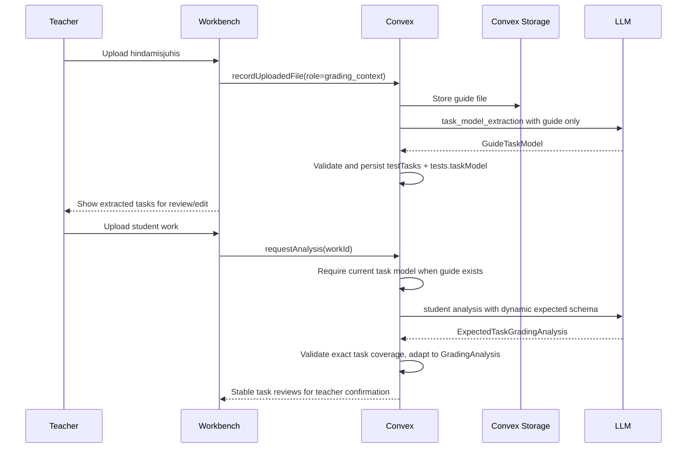
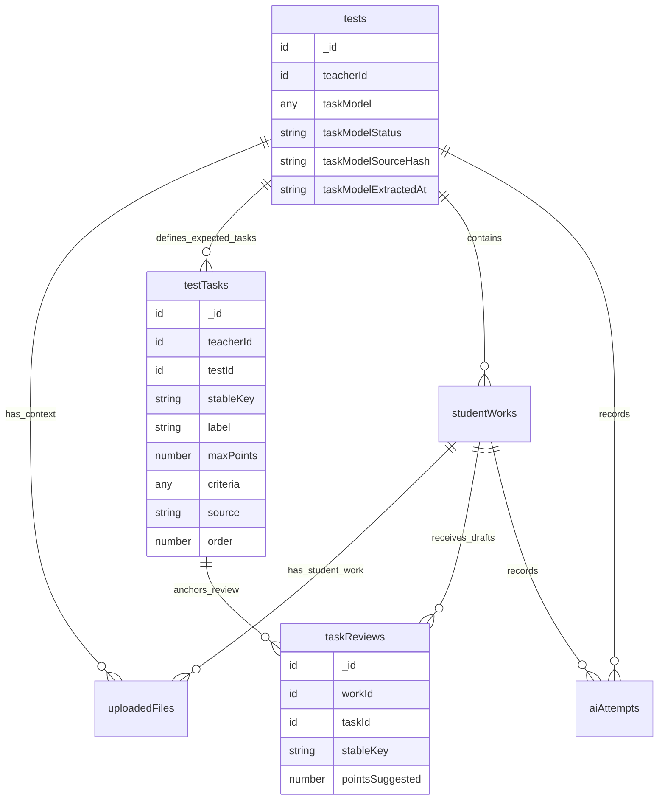

# feat: Add Guide-Derived Dynamic Task Schema

## Overview

RedPen currently sends each student work plus any uploaded `hindamisjuhis` / grading guide into a single grading call and asks the model to infer the visible task split per student. That is useful when no guide exists, but it is too loose when a guide has been uploaded: the same test should keep the same exercise structure, labels, ordering, max points, and grading criteria across every student work.

Change the AI process flow so a guide upload creates a guide-first task-model extraction step. When a grading guide exists, the first LLM call for that test extracts the expected test structure from the guide. Later student-work analysis calls use that persisted test task model and a runtime generated expected-output contract, so each student draft returns the same task keys and rubric maxima even when the uploaded student work only shows the first two exercises.

The no-guide path remains supported. If no guide exists, RedPen can keep using the current flexible `GradingAnalysis` flow and explicit uncertainty flags.

## Problem Statement

The current prompt tells the model to use a guide consistently, but the enforcement is still prompt-level. `GradingAnalysisSchema` accepts any `tasks` array, and `convex/aiActions.ts` sends guide uploads and student uploads together in one full-document analysis call. This allows the model to vary task names, task count, task order, or point maxima between students.

The concrete fixture scenario shows the gap:

- `fixtures/synthetic/juhis.pdf` is a synthetic grading guide with four exercises.
- `fixtures/synthetic/1o.jpg` and `fixtures/synthetic/1v.jpg` are synthetic student work images showing the first two exercises.
- Student analysis should still be shaped by all four guide tasks. Exercises 1 and 2 can be graded from visible work; exercises 3 and 4 should appear as expected tasks with clear missing/not-visible status rather than disappearing or being mistaken for zero-point attempts.

This matters because teachers compare multiple students inside the same test. They need one stable rubric spine, not separate task models invented independently per student.

## Research Summary

### Local Research

- `lib/ai-schemas.ts:3` defines one `GRADING_ANALYSIS_SCHEMA_VERSION`; `GradingAnalysisSchema` currently allows a flexible `tasks` array at `lib/ai-schemas.ts:96`.
- `lib/ai/prompts.ts:16` asks the model to analyze one student's complete work and split visible tasks; `lib/ai/prompts.ts:21` relies on prompt instruction for same-guide point consistency.
- `convex/aiActions.ts:83` currently performs one analysis action per work. It resolves guide uploads at `convex/aiActions.ts:86`, includes them before student work at `convex/aiActions.ts:195`, and submits one strict JSON schema request at `convex/aiActions.ts:222`.
- `convex/schema.ts:70` already stores `tests.taskModel`, and `convex/schema.ts:145` already has a `testTasks` table with `stableKey`, `label`, `maxPoints`, `criteria`, `source`, and `order`.
- `convex/tests.ts:89` already exposes `replaceTaskModel`, but there is no server-side guide extraction action that populates it.
- `convex/works.ts:100` and `convex/works.ts:129` already schedule one independent analysis per work, which should remain the unit of student analysis.
- `convex/works.ts:288` inserts task reviews from model-produced task drafts, but it does not yet link drafts to canonical `testTasks.taskId`.
- `tests/ai-schemas.test.ts:6` already guards strict-schema compatibility by rejecting schemas with optional object properties.
- `docs/architecture/system-model.md:273` currently describes one work-plus-context call as the MVP baseline; this plan refines that when a guide is present.
- `docs/prd/mvp-prd.md:59` says grading context can include a guide, and `docs/prd/mvp-prd.md:61` already calls for a task model with labels, criteria, max points, evidence, and uncertainty.

### Institutional Learnings

No `docs/solutions/` files were present, so there are no prior local solution notes to carry forward.

### External Research

OpenAI's Responses API supports structured outputs through JSON schema, including strict structured output mode. OpenAI's file input documentation supports PDF/image inputs in Responses, which matches the current guide PDF and student JPG path. OpenAI's data-control guidance remains relevant because both the guide extraction call and student analysis call must keep `store: false`.

The plan keeps dynamic-schema enforcement conservative: generate a test-specific schema where the supported JSON Schema subset is clear, and always run a server-side post-parse validator so task coverage is enforced even if a provider's strict-schema subset cannot express every constraint.

## Proposed Solution

Introduce two AI purposes:

1. `task_model_extraction`: guide-only call that extracts the expected task structure for a test.
2. `full_document_analysis_with_expected_tasks`: student-work call that uses the persisted task model and a dynamic expected-output schema.

If no guide exists, continue using the current `full_document_analysis` behavior with the base `GradingAnalysisSchema`.

### High-Level Flow



### Runtime Data Shape

Use `testTasks` as the canonical persisted task model for guide-derived tasks. Keep `tests.taskModel` as a denormalized cache during the MVP so existing APIs and UI reads can continue to use it. Every write that replaces the task model should update both in one mutation/action path.



Planned schema additions or refinements:

- Add task-model lifecycle fields to `tests`, such as `taskModelStatus`, `taskModelSourceHash`, `taskModelExtractedAt`, `taskModelReviewedAt`, and `taskModelError`.
- Extend `taskModelValidator` so guide-derived entries can carry `likelyTaskNumber`, `criteria`, `pointGuide`, `sourceRefs`, `extractionWarnings`, and nullable `maxPoints` without optional properties in the AI schema.
- Consider adding a `taskVisibility` or `submissionStatus` field to task drafts so missing guide tasks are not confused with true blank attempts.
- Link `taskReviews.taskId` to the matching `testTasks` row whenever an expected task model exists.

## AI Contract Design

### 1. Guide Extraction Schema

Add a fixed strict schema for extracting a task model from guide uploads, for example `GuideTaskModelSchema`.

```ts
type GuideTaskModel = {
  schemaVersion: "2026-05-22.guide-task-model.v1"
  sourceSummary: string
  tasks: {
    stableKey: string
    label: string
    likelyTaskNumber: string | null
    maxPoints: number | null
    criteria: {
      description: string
      pointGuide: string[]
      solutionNotes: string[]
    }
    sourceRefs: PageRef[]
    order: number
    extractionWarnings: string[]
  }[]
  totalMaxPoints: number | null
  reviewFlags: ("missing_rubric" | "unclear_task_structure" | "points_uncertain" | "guide_mismatch")[]
}
```

Rules:

- Stable keys should be deterministic from guide order: `task-01`, `task-02`, `task-03`, etc. Do not let semantic labels change keys.
- Preserve the guide's visible naming in `label`, such as `1. ...` or `Ulesanne 1`, without translating it.
- Preserve the guide's max points and point criteria. If points are unclear, use `maxPoints: null` and flags.
- Extract only the test's task/rubric structure. Do not grade any student work in this call.

### 2. Dynamic Student Analysis Schema

When a persisted task model exists, build a runtime expected schema from it. Prefer an object keyed by stable task key rather than a free-form array:

```ts
type ExpectedTaskGradingAnalysis = {
  schemaVersion: "2026-05-22.expected-task-grading-analysis.v1"
  studentName: StudentNameDraft
  transcription: {
    tasksByStableKey: {
      "task-01": TaskTranscriptionForExpectedTask
      "task-02": TaskTranscriptionForExpectedTask
      "task-03": TaskTranscriptionForExpectedTask
      "task-04": TaskTranscriptionForExpectedTask
    }
    unassignedText: string | null
  }
  tasksByStableKey: {
    "task-01": GradingDraftForExpectedTask
    "task-02": GradingDraftForExpectedTask
    "task-03": GradingDraftForExpectedTask
    "task-04": GradingDraftForExpectedTask
  }
  annotationTargets: AnnotationTarget[]
  generalFeedback: string
  suggestedTotalPoints: number | null
  maxPoints: number | null
  suggestedGrade: string | null
  reviewFlags: ReviewFlag[]
}
```

For each stable key, the generated JSON schema should constrain:

- `stableKey` to the exact expected literal.
- `label` to the extracted guide label or a validated copy of it.
- `likelyTaskNumber` to the extracted value or `null`.
- `rubric.maxPoints` to the extracted max points or `null`.
- `rubric.source` to `guidance_document` when guide extraction provided the task.
- Every expected task key must be present.
- No additional task keys are allowed.

After parsing, adapt this keyed shape back into the existing array-based `GradingAnalysis` shape in task-model order, so most UI and persistence code can migrate gradually.

### 3. Missing Task Semantics

Do not treat a not-visible guide task as automatically wrong.

For a guide with four exercises and a student upload showing only exercises 1 and 2:

- `task-01` and `task-02` should contain visible transcription and grading drafts.
- `task-03` and `task-04` should still be present.
- Their transcript should be empty or clearly state no visible work was found.
- Their draft should use a missing/not-visible status or `scoreBand: "unclear"` plus `missing_page` review flag.
- Suggested points should be `null` unless the teacher can reasonably decide from the visible submission that the task was blank.
- General feedback should not shame the student for missing tasks when the upload may simply be incomplete.

If the current `TaskScoreBandSchema` cannot express that distinction, add a field such as:

```ts
taskEvidenceStatus: "visible" | "not_visible_in_upload" | "blank_or_not_attempted" | "unclear"
```

This avoids conflating incomplete uploads with non-attempts.

## Technical Approach

### Schema And Prompt Modules

Create or extend:

- `lib/ai-schemas.ts`
- `lib/ai/guide-task-model.ts`
- `lib/ai/dynamic-analysis-schema.ts`
- `lib/ai/prompts.ts`

Keep schema versioning explicit:

- `GUIDE_TASK_MODEL_SCHEMA_VERSION`
- `GUIDE_TASK_MODEL_PROMPT_VERSION`
- `EXPECTED_TASK_GRADING_ANALYSIS_SCHEMA_VERSION`
- `EXPECTED_TASK_GRADING_ANALYSIS_PROMPT_VERSION`
- Existing `GRADING_ANALYSIS_SCHEMA_VERSION` for no-guide fallback

All object properties in model-facing schemas should be required with nullable values where needed, because strict structured outputs reject unsupported optional object properties.

### Convex Orchestration

Add a guide extraction action path in `convex/aiActions.ts`:

- `extractTaskModelInternal({ testId })`
- `extractTaskModelNow(ctx, testId)`
- `callOpenAIForTaskModel(...)`
- `recordAttemptStarted` with `purpose: "task_model_extraction"`
- `recordAttemptCompleted` / `recordAttemptFailed`
- Internal mutation to replace test task model and upsert `testTasks`

Update upload/test flow:

- On `uploads.recordUploadedFile` with `role === "grading_context"`, mark the test task model as stale or pending.
- Either schedule extraction immediately after guide upload or make `works.requestAnalysis` perform extraction first if the guide hash has changed.
- If guide uploads exist and task extraction failed, block student analysis by default with a clear retry path. Allow an explicit future override to analyze without guide model, but do not silently fall back.

Update student analysis:

- `works.requestAnalysis` and `works.requestAnalysisBatch` should ensure a current task model exists when guide uploads exist.
- `works.getForAi` should return the expected task model/testTasks with guide context.
- `aiActions.analyzeWorkNow` should choose:
  - no guide/task model: current base `GradingAnalysisSchema`
  - guide-derived task model: dynamic expected schema plus post-parse task-model validator
- `works.applyAnalysisDraft` should attach `taskId` when inserting `taskReviews`.

### Post-Parse Validation

Add a pure validator, for example `lib/ai/expected-task-validation.ts`, that checks:

- Every expected stable key is present once.
- No unexpected stable keys are present.
- Task labels match the task model or are replaced from the task model before persistence.
- Rubric maxima match the task model.
- `suggestedPoints.max` matches the task model.
- Total max points matches the sum of known task maxima.
- Missing visible tasks have safe `taskEvidenceStatus` or review flags.
- Annotation targets only reference expected stable keys.

The dynamic JSON schema helps the model produce the right shape; the server validator is the authority before persistence.

### UI Surface

Keep UI changes small and workflow-oriented:

- In the test rail, show task-model state after guide upload: extracting, ready, needs review, failed, or stale.
- Show extracted task count and total points.
- Let the teacher inspect/edit the extracted task model before running student analysis, using the existing `tests.replaceTaskModel` path or a refined task-model mutation.
- If guide extraction is pending or failed, disable "Run analysis" with a specific status message and retry action.
- In the review rail, preserve the expected guide task order even when a student upload only contains a subset of tasks.

Do not turn this into a broad task-model editor project. Split/merge editing can remain minimal unless needed to correct extraction.

## Implementation Phases

### Phase 1: Guide Task Model Contract

- Add `GuideTaskModelSchema` and JSON schema export.
- Add guide extraction prompt builders.
- Add strict-schema tests for the new schema.
- Add synthetic JSON fixtures representing the four-task `fixtures/synthetic/juhis.pdf` extraction.
- Add deterministic stable-key generation/normalization.

Acceptance criteria:

- [x] Guide task model schema is strict-output compatible.
- [x] Synthetic guide extraction fixture parses.
- [x] Extracted task keys are deterministic and ordered.
- [x] Max points and point criteria are represented without relying on student work.

### Phase 2: Persist Expected Tasks

- Add task-model lifecycle fields to `tests` if needed.
- Implement internal mutation to replace `testTasks` for a test and refresh `tests.taskModel`.
- Preserve teacher ownership checks for public mutations.
- Link task model records to guide source hash/attempt metadata.
- Update generated Convex types after schema changes.

Acceptance criteria:

- [x] Uploading or changing guide context can mark the task model pending/stale and queue extraction.
- [x] Extracted guide tasks are persisted as `testTasks` and mirrored in `tests.taskModel`.
- [x] Existing tests without guides continue to have an empty/flexible task model.
- [x] Teacher edits to task model update the same canonical records used by AI analysis.

### Phase 3: Extraction Orchestration

- Add `aiActions.extractTaskModelInternal`.
- Trigger extraction after guide upload or before the first student analysis when needed.
- Record `aiAttempts` with `purpose: "task_model_extraction"`.
- Keep `store: false`.
- Surface extraction failures without raw guide content in error text.

Acceptance criteria:

- [x] The first LLM call for a guided test extracts task structure before any student work analysis.
- [x] Failed extraction creates a failed `aiAttempts` row and a retryable test task-model state.
- [x] No student upload is sent during guide-only extraction.
- [x] Re-uploaded guide context causes re-extraction or stale-model warning.

### Phase 4: Dynamic Expected Student Schema

- Add a dynamic schema builder from persisted task model.
- Use `tasksByStableKey` / `transcription.tasksByStableKey` for guided analyses.
- Add a parser/adapter that converts expected-task output back to `GradingAnalysis`.
- Add post-parse validation for exact task coverage and rubric consistency.
- Preserve no-guide behavior with the current base schema.

Acceptance criteria:

- [x] Guided student analysis output includes every expected guide task exactly once.
- [x] Task labels and max points are taken from the persisted guide model, not reinvented per student.
- [x] Missing/not-visible guide tasks remain present and flagged for teacher review.
- [x] Unexpected task keys fail validation before persistence.
- [x] No-guide analysis still works with flexible task discovery.

### Phase 5: Persistence And Review Alignment

- Update `works.applyAnalysisDraft` to set `taskReviews.taskId`.
- Ensure re-analysis replaces draft reviews without deleting teacher-confirmed decisions unexpectedly.
- Preserve expected task order in review display.
- Keep annotation targets filtered by expected task keys.
- Keep teacher-confirmed results separate from AI drafts.

Acceptance criteria:

- [x] Task reviews for guided analyses link to `testTasks`.
- [x] Re-analysis keeps the same task spine across all student works in a test.
- [x] A two-page student upload containing only exercises 1 and 2 still produces review rows for exercises 1-4, with exercises 3-4 marked not visible or uncertain.
- [x] Teacher can confirm, edit, reject, or manually replace each expected task draft.

### Phase 6: Tests, Fixtures, And Docs

- Add tests for guide schema, dynamic schema generation, post-parse validation, and adapter behavior.
- Add fixture JSON for `fixtures/synthetic/juhis.pdf` with four exercises.
- Add fixture JSON for a student analysis where only first two guide tasks are visible.
- Update architecture and PRD docs to describe guide-first task extraction.
- Update README synthetic smoke-test instructions if the manual flow changes.

Acceptance criteria:

- [x] `npm run typecheck`
- [x] `npm run lint`
- [x] `npm run test:ai-contracts`
- [x] Focused Vitest tests for dynamic expected-task validation.
- [x] Synthetic fixture checks cover the guide PDF plus the two JPG partial-work scenario.

## Alternative Approaches Considered

### Keep Current Single-Call Prompt-Only Flow

Rejected as insufficient. Prompting can ask for consistency, but the schema and persistence layer still allow per-student drift in task count, labels, order, and point maxima.

### Extract Guide Text But Keep Flexible Student Schema

Partially useful, but still does not satisfy the requirement that the same fields be expected from all student uploads. This can be an intermediate implementation step only if dynamic schema generation needs to be staged.

### Require Teacher To Manually Enter The Task Model

Rejected for MVP ergonomics. Teacher review/edit remains important, but the guide already contains the structure and should be extracted automatically.

### Use Array Tuple Validation For Exact Tasks

Risky because provider strict-schema subsets can be narrower than full JSON Schema. A keyed object with generated properties and `additionalProperties: false` is easier to enforce, and the server validator remains the final authority.

## System-Wide Impact

### Interaction Graph

Guide upload triggers task-model stale/pending state, which triggers guide extraction, which writes `testTasks` and `tests.taskModel`, which changes the schema/prompt used by `works.requestAnalysis`, which changes the shape persisted by `works.applyAnalysisDraft`, which changes review rows and result confirmation.

### Error And Failure Propagation

- Guide extraction failure should attach error state to the test task model and the corresponding `aiAttempts` row.
- Student analysis should fail fast if a guide exists but no current task model exists.
- Dynamic schema validation failure should mark only the affected work as `error`, keeping other batch works independent.
- Provider errors should not include raw student or guide text in UI-visible error strings.

### State Lifecycle Risks

- Re-uploading a guide after student drafts exist can make old drafts stale. The UI should warn before re-analysis replaces draft reviews.
- Teacher-edited task models must not be overwritten silently by a later automatic extraction.
- Existing confirmed results should remain historically stable even if the test task model changes later.
- The task-model cache in `tests.taskModel` and canonical `testTasks` rows must be updated together.

### API Surface Parity

- Public teacher mutations must derive identity with `requireTeacher` and owned-test helpers.
- Internal AI actions may read storage and write task models only through ownership-preserving internal queries/mutations.
- The mock provider path must support guided task models so tests and local demos are not synthetic-only in shape.
- The provider-boundary class in `lib/ai/openai.ts` should either support the new schemas or be documented as secondary until wired into Convex production flow.

### Integration Test Scenarios

- [x] Guide-only extraction from a four-task fixture persists four expected tasks.
- [x] Student analysis for `1o.jpg` with four expected tasks returns task rows 1-4 in order.
- [x] Student analysis for `1v.jpg` uses the same stable keys and max points as `1o.jpg`.
- [x] Task 3 and task 4 are marked not visible/uncertain instead of absent.
- [x] Re-uploading `juhis.pdf` marks the guide model pending/stale and requires extraction before new analysis.
- [x] Batch analysis runs independently per work after one shared guide extraction.

## SpecFlow Analysis

### User Flow Overview

1. Teacher creates a test and uploads `hindamisjuhis`.
2. RedPen extracts the task model from the guide before analyzing student work.
3. Teacher optionally reviews or edits the extracted task model.
4. Teacher uploads one or more student works.
5. RedPen analyzes each student work against the same expected task model.
6. Teacher sees stable task review rows across students, including missing/not-visible expected tasks.
7. Teacher edits and confirms the final result.

### Flow Permutations

| Scenario | Expected behavior |
| --- | --- |
| Guide uploaded before student work | Extract task model immediately or before first analysis. |
| Student work uploaded before guide | Mark work upload ready, then extract guide model before analysis. |
| No guide uploaded | Use existing flexible full-document analysis schema. |
| Guide extraction fails | Show retry; block guided student analysis by default. |
| Guide has four tasks, upload has two visible tasks | Return four expected task drafts, flag non-visible tasks. |
| Teacher edits extracted task model | Use teacher-edited model for all later student analyses. |
| Guide re-uploaded after drafts exist | Mark task model stale and warn before replacing draft review rows. |

### Missing Elements To Resolve During Implementation

- Whether guide extraction should run immediately after upload or lazily when the first analysis is requested.
- Exact UI wording for "not visible in upload" versus "not attempted".
- Whether to introduce `taskEvidenceStatus` or extend `TaskScoreBandSchema`.
- Whether `tests.taskModel` remains long-term or becomes a cache over `testTasks`.
- How much task-model editing is needed in this plan versus a follow-up task editor plan.

Reasonable defaults:

- Extract lazily on first analysis if immediate scheduling becomes noisy; still ensure extraction is the first LLM call for guided tests.
- Add a dedicated task evidence/status field instead of overloading `scoreBand`.
- Treat `testTasks` as canonical and `tests.taskModel` as a temporary denormalized cache.

## Acceptance Criteria

### Functional Requirements

- [x] When a guide exists, RedPen extracts the test task model before any student work analysis call for that test.
- [x] The extracted model preserves guide task order, labels, task numbers, max points, point criteria, and evidence refs.
- [x] Student-work analysis for a guided test uses a runtime expected-output schema derived from the persisted task model.
- [x] Every guided student analysis returns the same expected task keys and max points for the same test.
- [x] Student uploads that only contain the first two exercises still produce expected rows for later guide tasks with safe missing/not-visible flags.
- [x] Teacher-edited task models override AI-extracted structure for later analyses.
- [x] No-guide tests continue to use flexible task discovery.

### Non-Functional Requirements

- [x] OpenAI/Responses calls keep `store: false`.
- [x] Guide extraction sends guide uploads only, not student work.
- [x] Public mutations never accept client-supplied `teacherId`.
- [x] Dynamic schemas stay strict-output compatible, with server post-parse validation as the final guard.
- [x] UI-visible errors avoid raw guide or student content.

### Quality Gates

- [x] Strict schema tests cover both guide extraction and expected-task analysis.
- [x] Dynamic schema builder tests prove exact expected keys and no additional keys.
- [x] Adapter tests prove keyed expected-task output becomes ordered `GradingAnalysis` tasks.
- [x] Fixture tests include `fixtures/synthetic/juhis.pdf`, `fixtures/synthetic/1o.jpg`, and `fixtures/synthetic/1v.jpg` scenario expectations.
- [x] Architecture, PRD, and README stay aligned with the new two-stage guided pipeline.

## Success Metrics

- Guided analyses for all students in one test share identical task keys, labels, order, and max points.
- Teachers can compare task 1 across students without relabeling or merging model-generated variants.
- The fixture scenario with a four-task guide and two-task student images produces reviewable drafts without losing tasks 3 and 4.
- Schema validation failures are caught before persistence and produce retryable work/test states.
- No-guide analysis quality and speed remain unchanged.

## Dependencies And Risks

- Dynamic JSON schema support must stay within the provider's strict structured-output subset.
- A guide PDF may be ambiguous or scanned poorly; extraction must surface uncertainty and let the teacher edit.
- Re-extraction can invalidate in-progress drafts; the UI needs stale-model warnings.
- Persisting both `testTasks` and `tests.taskModel` can drift if not updated through one path.
- Missing visible tasks are pedagogically sensitive: RedPen must avoid awarding zero when the upload may simply be incomplete.
- Batch analysis should not duplicate guide extraction per work.

## Out Of Scope

- Automatic final grading or publishing.
- Full task split/merge editor polish beyond what is needed to review extracted guide tasks.
- Crop-first analysis.
- Production Azure/Foundry hardening.
- eKool/Stuudium production integration.
- Any use of real student fixtures or real classroom guide documents.

## Sources & References

### Internal References

- `lib/ai-schemas.ts:96` - current flexible `GradingAnalysisSchema`.
- `lib/ai/prompts.ts:16` - current one-pass student analysis prompt.
- `convex/aiActions.ts:83` - current analysis action per student work.
- `convex/aiActions.ts:203` - current Responses request with `store: false` and strict schema.
- `convex/schema.ts:70` - existing `tests.taskModel`.
- `convex/schema.ts:145` - existing `testTasks` table.
- `convex/tests.ts:89` - existing `replaceTaskModel` mutation.
- `convex/works.ts:288` - current task review insertion from AI drafts.
- `docs/architecture/system-model.md:273` - current one-call-per-student-work architecture.
- `docs/prd/mvp-prd.md:59` - grading context and task model requirements.
- `fixtures/synthetic/README.md` - synthetic fixture guidance.

### External References

- OpenAI structured outputs: https://platform.openai.com/docs/guides/structured-outputs
- OpenAI file inputs for Responses: https://platform.openai.com/docs/guides/file-inputs
- OpenAI API data controls: https://platform.openai.com/docs/guides/your-data
